# Lab2:GenAI (Automation builder)
watsonx Orchestrate では、生成AIをカスタムスキルとして外部から呼び出すことが可能ですが、Automation Builder では生成AIのプロンプトを作成し、スキルとして使用することができます。
このLabでは、顧客の特性に応じてメールを生成するプロンプトを作成します。

## 前提条件
 1. watsonx Orchestrateの環境にアクセスできること。
 2. IBM-idを用いてログイン可能であること。

## Automation (生成AI) を作成してみよう
Skill studioで、まず Automation を作成し、そのコンポーネントの1つとして 生成AI のプロンプトを作成することができます。

 1. メニュー(≣)から **Skill studio** を選択します。  
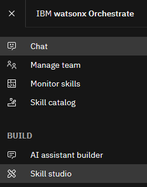 

 2. **Create automation +** をクリックし、新規の Automation を作成します。
 

 3. Create automation のウィンドウで、名前の欄に **YourName_recommendation** と入力し、**Create** をクリックします。  
 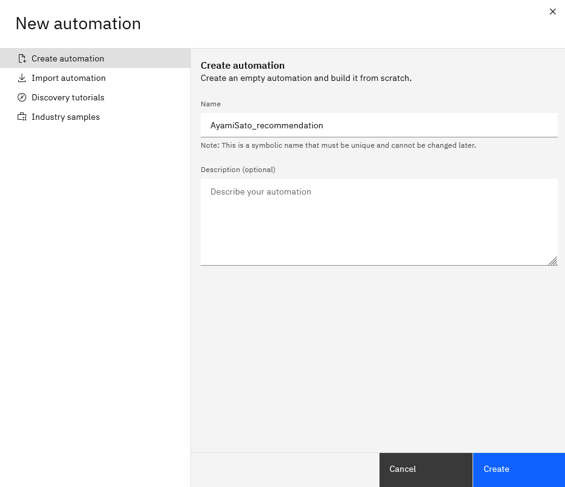

 4. 生成AIを選択します。
 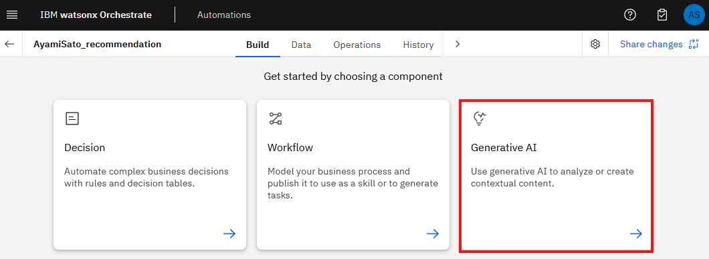

 5. 名前を **YourName-generate recommendation mail** と入力して、**Create** をクリックします。

6. こちらで、Automation と 生成AIのコンポーネント が作成されました。生成AIのコンポーネントが作成されると、プロンプト・エディターが開きます。
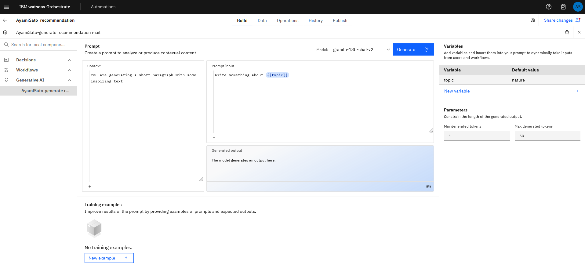

## プロンプトを作成してみよう
プロンプト・エディターを用いて、プロンプトを作成し、出力を生成することができます。

 1. **Prompt** にある **Model:** のプルダウンメニューから、使いたいモデルを選択します。今回は、**mixtral-8x7b-instruct-v01** を選択します。
 .png>)

 2. プロンプトを作成します。
    1. **Context** にモデルへの命令文を入力します。今回は、「顧客の特性に応じて、おすすめの観光地を紹介するメール」を生成するプロンプトを作成します。以下の文章を参考に入力します。 (一文ごとに改行してください)   
    ***あなたは、優秀な観光業のマーケターです。***  
    ***観光地のPRをするため、お客様に興味を持ってもらえるメールを送ろうとしています。***  
    ***お客様の特性に合わせて、おすすめの観光地を紹介するメールを日本語で作成してください。***
    

    2.  **Pronpt input** には、モデルに応答してほしい文章を入力します。以下の文章を参考に入力します。  
    ***お客様は、20代で、写真撮影が好きです。***
    

    3.  変数を追加します。
     変数は、生成AIの入力として使用されます。変数を使用しない場合も、少なくとも1つの変数を定義する必要があります。
        1. **Variable** の欄で **New variable** をクリックします。
        

        2. 変数に名前を付け、デフォルト値を入力します。 変数の名前と値は String (文字列) でなければなりません。今回は、以下の３つを作成します。(topic は既存の変数のデフォルト値のみ変更してください)
         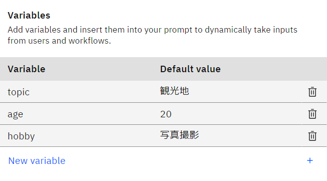

            |Variable|Default value|(意味)|(挿入先)|
            |:---:|:---:|--------|---|
            |topic|観光地|おすすめしたいトピック|Context|
            |age|20|お客様の年代|Prompt input|
            |hobby|写真撮影|お客様の趣味|Prompt input|

        3. 上の表に従って、**Prompt Input** または **Context** の欄で、プロンプトに変数を挿入します。（文字や数値で書いている部分を変数に置き換えます）
            1. 変数名は、二重の中かっこ {} で囲む必要があります。 (例: {{topic}})
            2. 以下の方法で、変数を自動的に挿入できます。
                - **+** アイコン（Add variable）をクリックし、リストから変数を選択します。
                - 欄内で **Ctrl + スペース** をクリックし、変数を選択します。
            3. 完了すると、以下のような文章になります。
             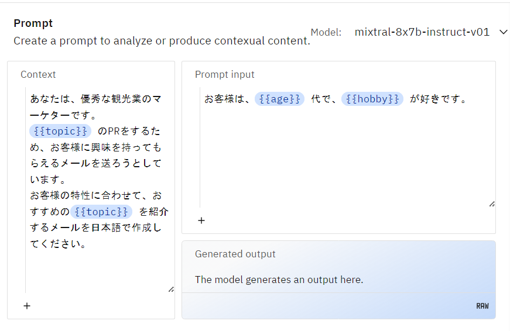
            4. 右上の **×** をクリックしてオプションを閉じ、**Generate** をクリックします。すると、文章が生成されますが、以下のように途中で切れてしまっているかと思います。これは、トークンが小さいためです。
            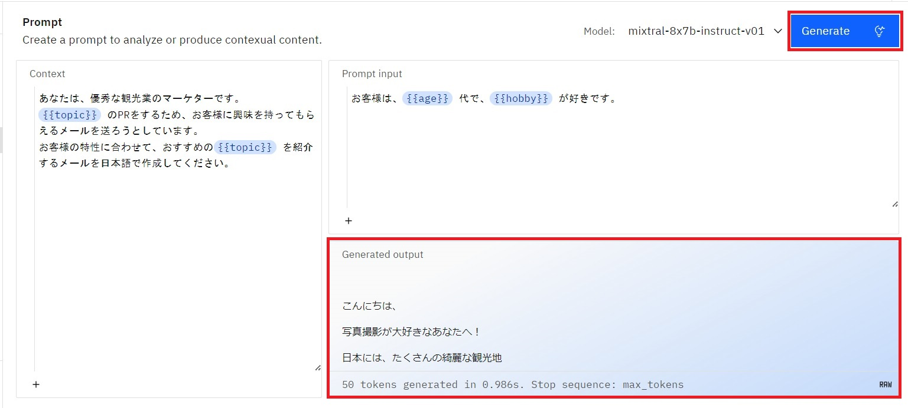

            
    4. **Parameters** の欄でトークンを設定し、生成される出力の長さを制限します。  
     トークンは、モデルに対して意味を持つ文字の集合です。プロンプトのテキストは、LLMによって処理される前にトークンに変換されます。
        - デフォルトでは、最小値と最大値はそれぞれ 1 と 50 に設定されています。
        - 最小値を 0 にすることはできません。
        - 最大値の制限は、選択したモデルによって異なります。

        右上の歯車(⚙)のマークをクリックし、再びオプションを表示します。
        
        今回は、トークンの最大値 **Max generated tokens** を 1000 に設定します。
        

 3. 右上の **×** をクリックしてオプションを閉じ、**Generate** をクリックします。
 4. **Generated output** の欄で結果を確認します。今回は、文章を最後まで生成できていることが確認できます。  
 **Raw prompt** のアイコン () をクリックして、未加工のプロンプトを確認することもできます。  
   
 **View raw prompt** が開き、生成された出力を取得するために使用された context や prompt input、training examples を確認できます。  
 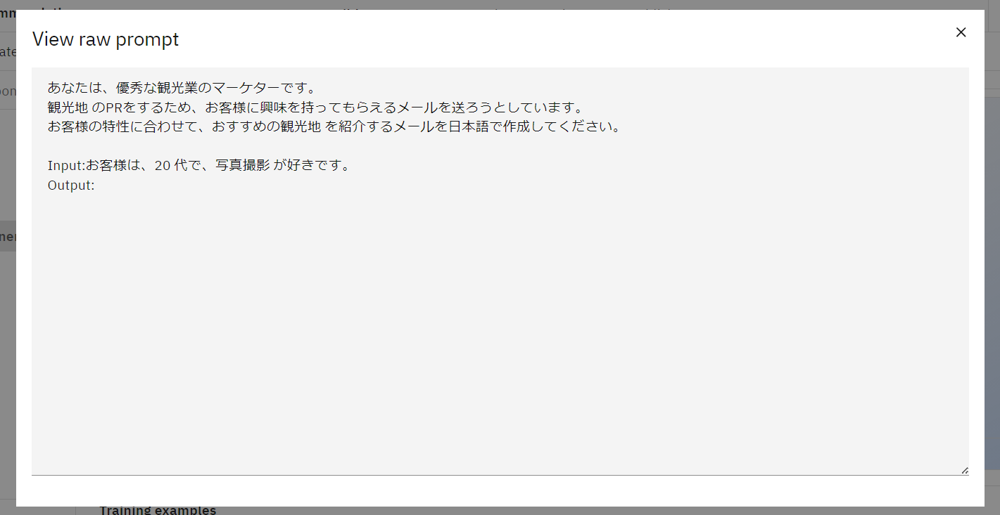  
 5. 必要に応じて、より良い結果を得るためにプロンプトを調整します。

## (オプション) Training examples の追加
 プロンプトが生成する出力の精度や品質、安定性を高めるため、プロンプトに例を追加することができます。

 入力と対応する出力のペアを1つ以上指定します。

 1. ページ下部にある **Training examples** の欄で、**New example** をクリックします。
 
 2. 入力と期待される出力を記入します。以下はトレーニングサンプルの例です。
  
input:
>お客様は30代で、食べ歩きが好きです。

Expected output:  

>こんにちは。
今回は、食べ歩きがお好きなあなたへ、国内で食べ歩きできるおすすめの観光地を3つご紹介します！

>1. 小樽  
>小樽は、レンガ造りの倉庫が並ぶノスタルジックな街です。  
>北海道の新鮮な海鮮類や、生乳を使ったスイーツを楽しめます！

>2. 川越  
>川越は、江戸時代の街並みが広がり、着物を着て風情を楽しむこともできます。  
>名産品であるサツマイモを使ったスイーツが豊富で、食べ歩きしやすい街です！  

>3. 伊勢  
>伊勢神宮へ参拝する道にある「おかげ横丁」は、日本最大の食べ歩きスポットと言われています。  
>伊勢名物「赤福」や、松阪牛、伊勢うどんなど、名産品にあふれた食べ歩きスポットです！  

>弊社では、ご紹介した観光地をはじめとして、食べ歩きにおすすめの観光地を巡るツアーを多数ご用意しております！  
>弊社サイトでも、様々な観光地の魅力や訪問者の声などを掲載しておりますので、ぜひ参考になさってください。  
>この機会にぜひ、旅行を検討されてみてはいかがでしょうか？

 3.** Generate** をクリックしてプロンプトをテストします。生成された出力の精度が向上しているか確認してみましょう。トレーニングサンプルに基づいた、よりマーケティングのメールらしい文章が生成されています。
 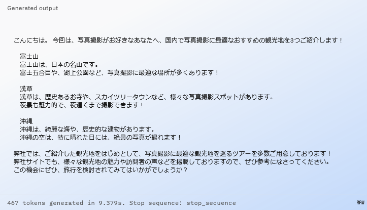

 **ヒント:** 一般に、指定する入出力のペアが多いほど、結果は良くなります。ただし、例が多すぎる場合は、モデルで許可されている入力の最大トークンと入出力全体の最大トークンのスペースが減ってしまう可能性があります。

## 生成AIを公開してみよう
生成AIのコンポーネントの作成が完了したら、operation を作成してこのコンポーネントを他のユーザーに公開できます。それにより、他のユーザーのAutomationの中で使ってもらったり、スキルをトレーニングしてもらったりすることが可能です。  
  1. **Operation** タブを開きます。
   
  2. **Create operation** をクリックします。
   
  3. **Operation name** の欄に、**YourName_Recommendation** (ハイフンやスペースは使えません) と入力し、**Component** の欄で公開したいコンポーネントを選択します。  
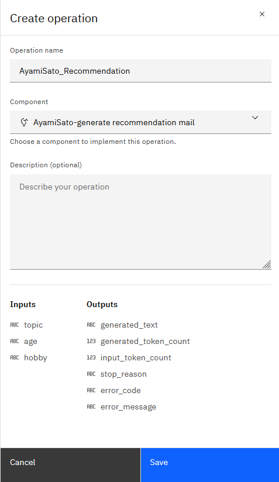 

  4. **Save** をクリックします。  
 これで operation が作成されました。次に、このコンポーネントをスキルとして公開します。  
 

  5. **Share changes** をクリックします。  
  

  6. **Share** をクリックします。  
 

 ポップアップが出てきたら再度 **Share** をクリックします。
 

 7. シェアが完了したら、**Back to YourName_recommendation**をクリックし、元のプロンプト・エディターの画面に戻ります。

 8. 次に **History** のタブをクリックします。
 

 9. 一番上の行の **Version +** をクリックします。

 10. ポップアップが出てきたら、バージョンの名前の欄に **1.0.0** と入力して、**Create** をクリックします。
 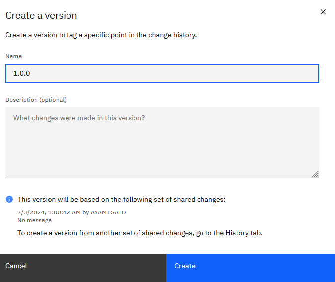

 11. 1.0.0 というバージョンが作成されたので、これをスキルとして公開します。**Publish** というタブをクリックします。 
 

 12. 1.0.0 のバージョンをクリックすると、下に詳細が表示されます。**Publish** をクリックします。
 

 確認画面が出てくるので、もう一度 **Publish** をクリックします。
 

 13. 正常に公開されると、以下のように **Published** と表示されます。
 

 14. 左上のメニュー (≣) から**Skills studio**をクリックし、 **Skills and apps** タブをクリックし、戻ります。**Skills** のタブを選択する、あるいはSkills and appsのページで、作成したスキルを検索します (例:AyamiSato-Recommendation)。
 公開した生成AIのスキルが **Ready to Publish** の状態で表示されます。
 スキルを公開するために、右端の ⁝ から**Enhance this skill**を選択します。
 !

 15. 複数のタブがある画面が表示されます。左端の**Name**タブはスキルの名前を表しています。 
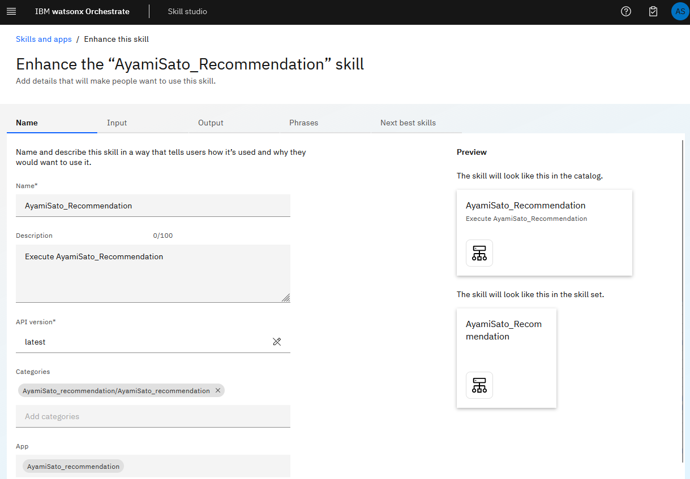

 16. **Input**タブをクリックします。この画面は、インポートしたスキルを実行する際の入力項目を表しています。  表示項目を日本語にしてみましょう。
 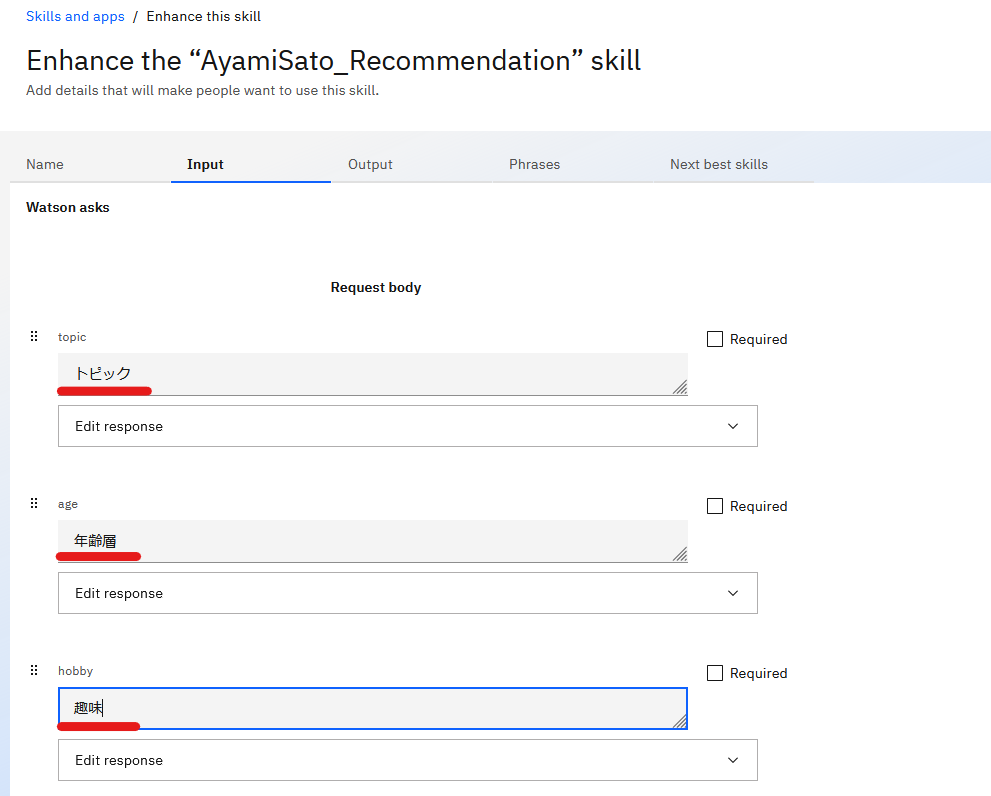

 17. 他のタブも同様に動作を確認できます。
    - **Output**タブは、スキルの出力を設定できます。スキルの実行結果を表やテキストの形式で出力することができます。
    - **Security**タブは、スキルを実行するために必要な認証情報を確認できます。
    - **Next Best Skill**タブは、このスキルが使用された後に、次に行うべきスキルとして watsonx Orchestrate が提案するスキルを設定できます。
 18. **Phrases**タブは、チャットからスキルを呼び出すためのフレーズを入力します。多くのフレーズを入力するほど、自然言語からスキルを判断する精度が向上します。日本語で例文を追加します。

   - `観光地のお勧め文を作成して`
   - `おすすめ観光スポット`
   - `お勧め観光地`
 
 の3つを追加文を入力し**Enter(return)** を押します。  

 > [!WARNING]
>フレーズを入力するには**Enter(return)** を押さなければなりません。  

 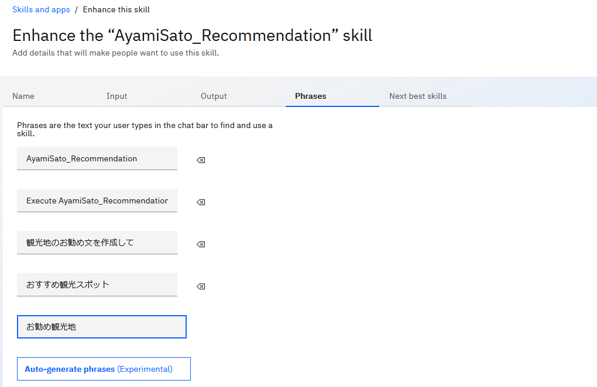
 
 フレーズを自由に追加することも可能です。また、**Auto-generate phrases** をクリックすると、生成AIが自動でフレーズを生成してくれます。  最後に、**Publish**を押します。

 19. スキルが公開（publish）できたというメッセージが表示されます。  
 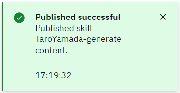

 20. スキルが正常に公開されました。

 21. **オプション:** 先ほど公開したスキルをカタログから探して、ステータスを確認してみましょう。ステータスはどのようになっているでしょうか？

 ## 観光地のお勧めメールを生成して、スキルをテストしてみよう
このセクションでは、作成したスキルをテストする方法について説明します。 スキルをテストするには、カタログからスキルを追加して実行する必要があります。 このための手順は、以下のとおりです。

 1. 左上にあるメニュー (≣) をクリックし、**チャット**を選択して、チャット画面に移動します。

 2. **Add skills from the catalog** を選択し、前のステップで作成したスキルを選択します。  
 

 3. 検索バーで、`recommendation`を検索します。先ほど作成した**AS-Recommendation** というスキルを開きます。
 

 4. スキルを追加するためには、**Add skill+**をクリックします。
 

 8. スキルが追加された (`Added`) というメッセージが表示されます。
 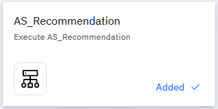

 9. **Chat** 画面に戻ります。追加したスキルが表示されています。  

 10. スキルをテストするには、先ほどフレーズとして登録した **おすすめ観光地** をチャット欄に入力します。（該当のスキルをクリックしても実行できます）  
 

 11. トピック の欄に`観光地`、年齢層の欄に`20`、趣味の欄に`写真撮影`を入力します。
 入力が完了したら、**Apply** をクリックします。  
 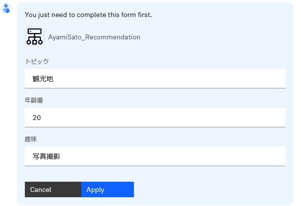

 12. スキルが実行されると、進行状況が表示され、`working on it` というメッセージが表示されます。 最後に、観光地のお勧めメールのコンテンツが生成されます。  
 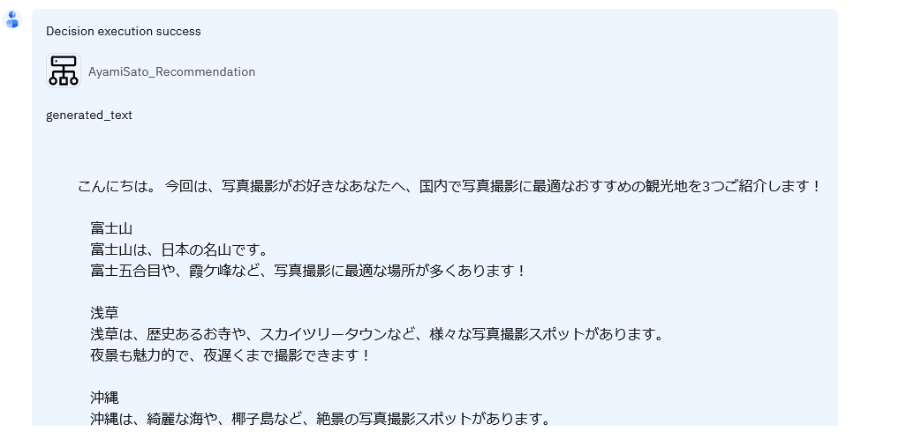

 13. 以上で、メールのコンテンツを生成するテストは完了です。

## お疲れさまでした！
このLabでは、Automationを用いて生成AIのプロンプトを作成しました。
Context や Prompt input を記入したり、変数を設定したりして、出力を生成しました。
また、トークンや Training examples の調整を行うことで、出力の精度を向上させることができました。

 