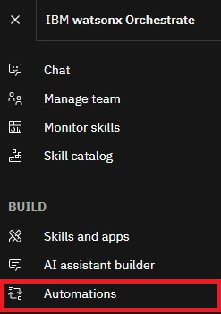
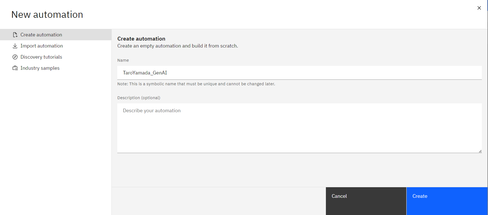
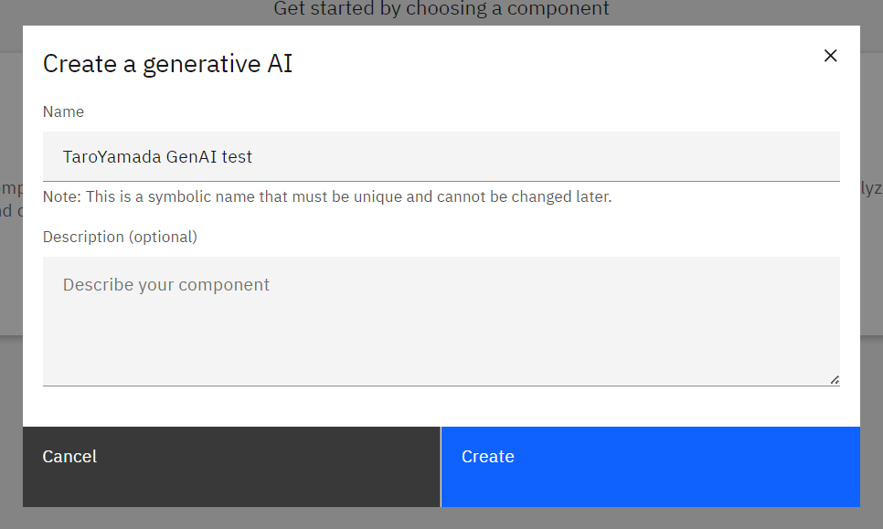

# Automation builder (生成AI)
Automation Builderでは、ワークフローやルールエンジンに加え、生成AIのプロンプトを作成することができます。
このLabでは、顧客に合わせたメール文面を日本語で生成するプロンプトを作成します。

## 前提条件
 1. watsonx Orchestrateの環境にアクセスできること。
 2. IBM-idを用いてログイン可能であること。

## Automation (生成AI) を作成してみよう
Automation builder では、Lab3 と同様に Automation のアプリケーションを作成し、生成AI のプロンプトを作成できます。

 1. メニュー(≣)から **Automations** を選択します。  
    

 2. **Create automation +** をクリックし、新規の Automation を作成します。
 

 3. Create automation のウィンドウで、名前の欄に **YourName-GenAI** と入力し、**Create** をクリックします。  
 

 4. 生成AIを選択します。
 
 名前を **YourName GenAI test** と入力して、**Create** をクリックします。
 

こちらで、Automation と 生成AIのコンポーネント が作成されました。作成されると、プロンプト・エディターが開きます。

## プロンプトを作成してみよう
プロンプト・エディターを用いて、プロンプトを作成し、出力を生成することができます。

 1. **Model:** のプルダウンメニューから、使いたいモデルを選択します。今回は、
 
 2. プロンプトを作成します。
    1. (オプション) **Context** にモデルへの指示文を入力します。

    2. (オプション) **Pronpt input** にモデルに応答してほしい文章を入力します。

    3. (オプション) 変数を追加します。
     変数は、生成AIの入力として使用されます。変数を使用しない場合も、少なくとも1つの変数を定義する必要があります。
        1. **Variable** の欄で **New variable** をクリックします。
        2. 変数に名前を付け、デフォルト値を入力します。 変数の名前と値は String でなければなりません。
        3. **Prompt Input** または **Context** の欄で、プロンプトに変数を挿入します。
            - 変数名は、二重の中括弧 {} で囲む必要があります。 (例: {{topic}})
            - 以下の方法で、変数を自動的に挿入できます。
                - **+** アイコン（Add variable）をクリックし、リストから変数を選択します。
                - 欄内で **Ctrl + スペース**をクリックし、変数を選択します。
    4. (オプション) **Parameters** の欄でトークンを設定し、生成される出力の長さを制限します。
     トークンは、

     シナリオ考える（メールなど）
     日本語で動かして（llama-2）にして

 