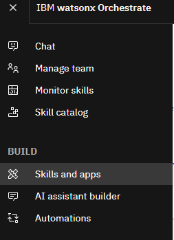
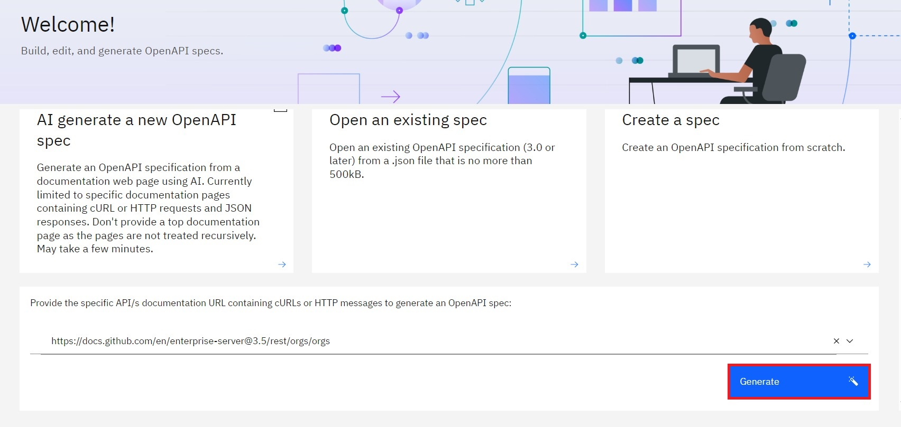
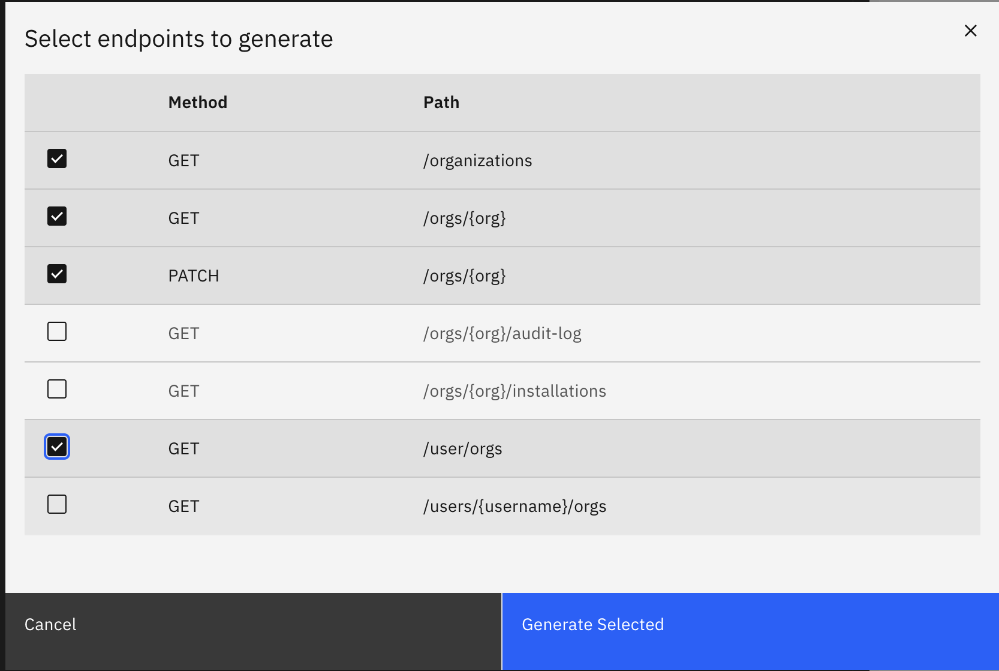
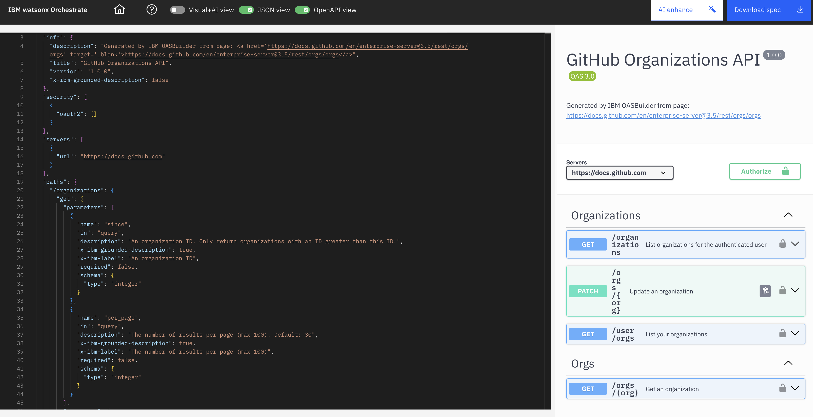
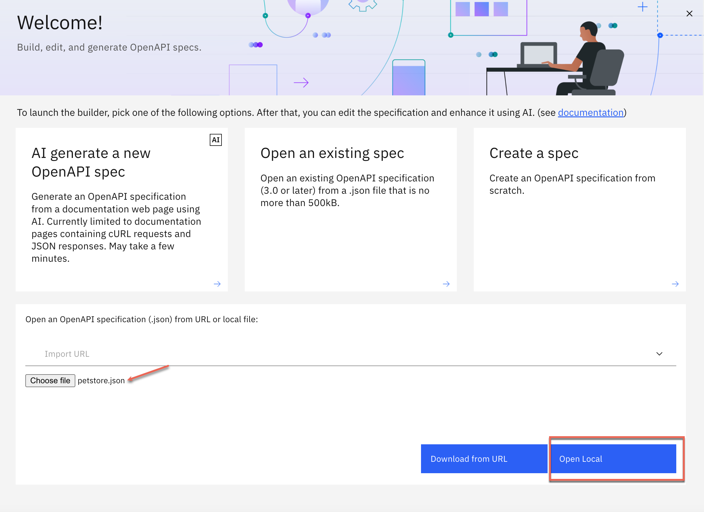
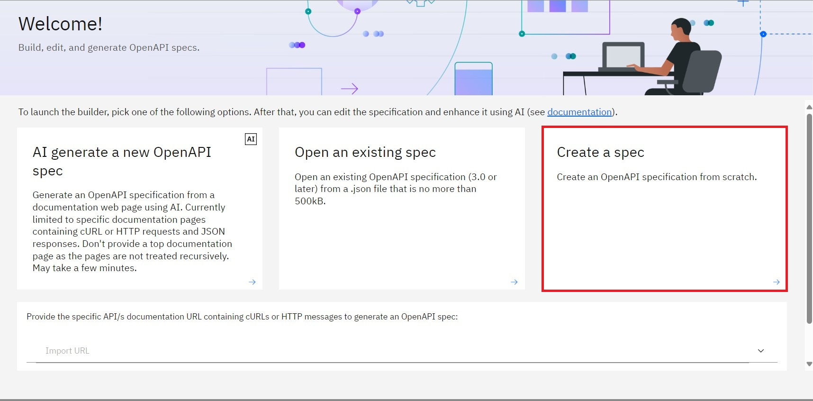
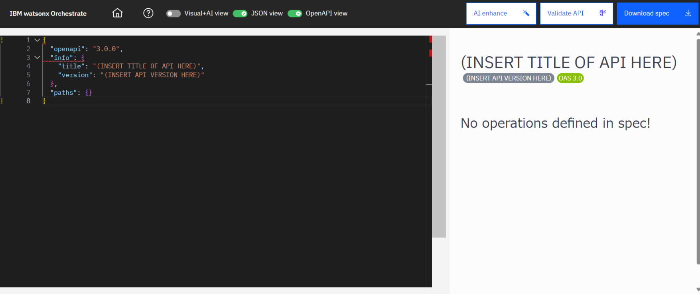
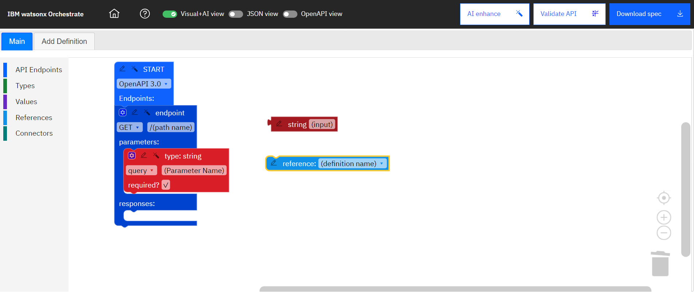
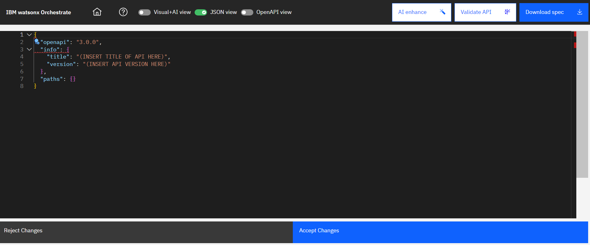
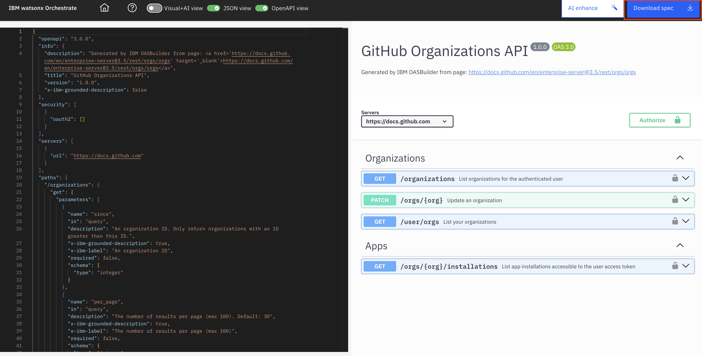

# OpenAPI builder
watsonx Orchestrate でカスタムスキルを使う際には、OpenAPIの仕様書が必要です。ただ、時には仕様書がない場合もあります。その際に、仕様書を作成できるのが OpenAPI Builder です。

このLabでは、OpenAPI builder を用いて Open API の仕様書（OAS）の作成、編集、生成を行う方法を練習します。

## 前提条件
 1. watsonx Orchestrateの環境にアクセスできること。
 2. IBM-idを用いてログイン可能であること。

## 資料の Web ページから OpenAPI 仕様書を生成してみよう
 AIを使用して、資料の Web ページから OpenAPI の仕様書を生成できます。手順は以下のようになります。

 1. メニュー(≣)から **Skills and apps** を選択します。  

 2. Skills and apps ページで、**Add skills** をクリックします。
 

 3. **OpenAPI builder (experimental)** を選択し、OpenAPI builder のタイルをクリックします。
 

 4. **AI generate a new OpenAPI spec** を選択します。その後、**Import URL** の欄にAPI仕様書を作成したい文書のURLを入力します。例えば、Github の REST API からOpenAPIの仕様書を作りたい場合は、以下のURL（https://docs.github.com/en/enterprise-server@3.5/rest/orgs/orgs）を入力します。（空のボックスをクリックすると、チュートリアル用のURLが候補として表示されます）  
   

 5. **Generate** をクリックします。
 

 6. OpenAPI の仕様書に入れたいエンドポイントを選択します。  
 

 7. **Generate Selected** をクリックします。すると、OpenAPI の仕様書が生成され、選択したエンドポイントが含まれていることが確認できます。
 

以上で、OpenAPI 仕様書を生成し、編集を始められるようになりました。

## 既存のOpenAPI 仕様書を開いてみよう
Orchestrate では、既存のOpenAPI 仕様書を開いて編集することも可能です。

 1. 先ほどの 1~3 と同様に行います。

 2. **Open an existing spec** を選択します。

 3. 以下のいずれかの手順で、既存のOpenAPI 仕様書を開くことができます。
    1. **Import URL** に仕様書のURLを入力し、**Download from URL** をクリックします。（空のボックスをクリックすると、チュートリアル用のURLが候補として表示されます）  
     

    2. ご自身のローカルシステムから仕様書を開きたい時は、
        1. **Choose file** を選択します。
        2. 必要なファイルを選択し、**Open** をクリックします。
        3. **Open Local** をクリックします。
     
    
これで、OpenAPI builder上でOpenAPI 仕様書を開くことができました。

## 一から OpenAPI 仕様書を作ってみよう
OpenAPI builder を使用すると、scratch からも OpenAPI 仕様書を作成することができます。

 1. 先ほどの 1~3 と同様に行います。

 2. **Create a spec (Create an OpenAPI specification from scratch)** を選択します。  
 

 3. 書き始めのテンプレートが表示されるので、仕様を自由に追加します。仕様書の作成方法については、[こちら](https://www.ibm.com/docs/ja/watson-orchestrate?topic=skills-creating-openapi-specifications)（watsonx Orchestrate 製品資料）もご覧ください。  
 

 4. ファイルの変更を保存するには、**Apply changes** をクリックします。  
 ファイルをダウンロードする際は、**Download spec** をクリックします。
 

ここで作成したOpenAPI 仕様書をインポートし、watsonx Orchestrate にスキルとして追加することも可能です。

## OpenAPI builderのエディターを使ってみよう
OpenAPI builderでは、AIを用いて文書からOpenAPI 仕様書を作成したり、AIの提案をもとに仕様書を編集することが可能です。

以下のフォーマットから、仕様書を確認、編集することができます。

- **Visual+AI view**
 Visual+AI view では、視覚的な表示で API 仕様書を作成することができます。AI による提案を使用することもできます。このエディターで編集する方法については、[こちら](https://www.ibm.com/docs/ja/watson-orchestrate?topic=builder-using-visual-editor-in-openapi)もご参照ください。
 

- **JSON view**
 JSON View では、テキスト形式で API 仕様書を作成できます。
 

- **OpenAPI view**
 OpenAPI view では、標準のAPI仕様書の形式に従って表示されます。

デフォルトでは、JSON view と OpenAPI view が表示されています。Visual+AI view を表示するには、上部の **Visual+AI view** ボタンをオンにします。  

**注釈:** 家のアイコンをクリックすると、OpenAPI builder のホームページが表示されます。

## OpenAPI仕様書を OpenAPI builder からダウンロードしてみよう
OpenAPI builder から、OpenAPI 仕様書を JSON ファイルでローカルにダウンロードし、watsonx Orchestrate や他のツールにインポートすることができます。もちろん、OpenAPI builder に再インポートして編集することも可能です。

ダウンロードするには、エディターの画面で **Download spec** をクリックします。

## お疲れさまでした！
このLabでは、OpenAPI builder を用いて、OpenAPI の仕様書を作成、編集、生成する方法を確認しました。
仕様書はWebページからAIで自動生成できるほか、既存ファイルの編集や、新規作成も可能です。
作成時のビューは、Visual+AI view、JSON view、OpenAPI view の3つを使用でき、AIによる提案も活用できます。
仕様書の作成後は、watsonx Orchestrate にインポートしてスキルとして利用できます。