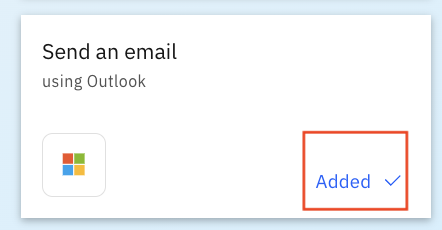
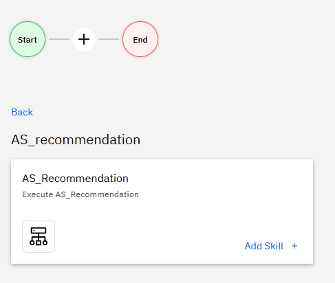
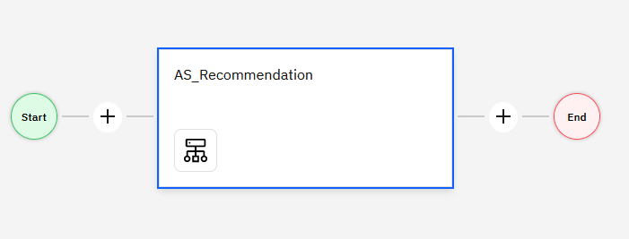
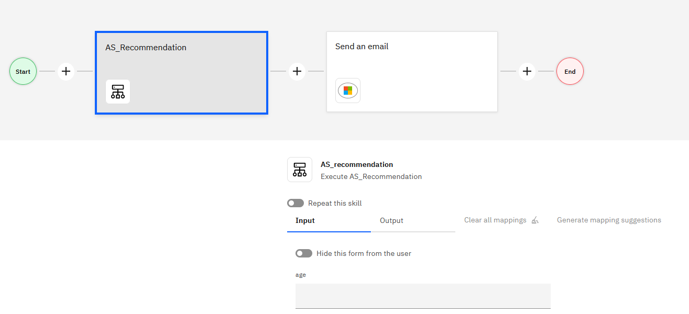

# Technical Lab2

このLabでは、GenAIで作成したコンテンツ生成のスキルと、Outlookでメールを送信するプリビルドスキルを組み合わせて、スキルフローを作成します。

## 前提条件
 1. watsonx Orchestrate の環境にアクセスできること。
 2. IBM-id を用いてログイン可能であること。
 3. スキルの作成、追加を行う権限があること。
 4. Outlook のメールアドレスとパスワード (講師から配布されます)

## カタログからスキルを追加し、Outlookでメールを送ろう
Outlook でメールを送信するスキルは、プリビルドスキルとして既に watsonx Orchestrate にインポートされています。  
このスキルを追加し、Microsoft Outlook に接続してテストする必要があります。  
Outlook に接続してメールを送信できるようにするには資格情報が必要になります。今回の環境では、差出人として、自身のメールアドレスと資格情報を使用することはできません。

 1. **Chat** に移動し **Add skills from the catalog** をクリックするか、左上のメニューに移動して **Skills catalog** を選択します。
 

 2. **Microsoft Outlook** を検索します。
 

 3. **Microsoft Outlook** をクリックし、**Send an email using Outlook** の中で **Add skill** を選択します。 これで、このスキルは **Added** として表示されます。  
 

 4. **Chat** 画面に移動すると (**Menu** -> **Chat**) 、このセクションで追加された 2 つのスキルが表示されます。
 

 5. これで、**Send emaill** スキルを追加するセクションは完了です。

## 自身のメールアドレスへメールを送り、スキルをテストしてみよう
このステップでは、スキルを Microsoft Outlook に接続します。 この資格情報は、講師から提供されます。

 1. **Chat** 画面に移動します。

 2. **Send email** スキルを選択します。右下にリンク切れのマークが表示されています。これは、スキルがどのメールシステムにも接続されていないことを意味します。  
 

 3. リンク切れの (緑色のボックスで囲んだ)マークをクリックします。 スキルが Microsoft Outlook に接続されていないことが通知されます。 **Connect app** をクリックして Microsoft Outlook に接続します。 
 

 4. **Type** はデフォルト値の **Non-admin user** を使用し、**Connect app** ボタンをクリックします。 これにより、Outlookに移動します。 講師から提供される資格情報を使用します。 (今回の環境では、IBM のメールアドレスを使用して Outlook に接続することはできません)   
   

 5. **※パスワードは、ブラウザーやパスワード・マネージャーに保存しないようにご注意ください。**  
 

 6. アプリが接続されたことが確認できます。
 

 7. スキルをテストするために **Chat** 画面に移動します。**Send an email** スキルをクリックします。

 8. **To:** の欄はご自身のメールアドレスを使用します。**Subject** の欄に件名を記入します。（例: `Test send email skill`）**Content** 欄はメール本文を入力します。（例: `Hello and welcome!`）**Apply** ボタンをクリックします。
 

 9. `The email was sent` というメッセージが表示されます。ご自身のメールボックスにメールが送信されているか確認してみてください。

 10. これで **Send email** スキルをテストするステップは完了です。

## 2つのスキルを組み合わせてスキルフローを作成しよう
これまでは、個々のスキルを作成、追加、テストを行いました。watsonx Orchestrate では、個々のスキルだけでなく、2つ以上のスキルを組み合わせて、スキルフローを作成することができます。 手順は以下のとおりです。

 1. **Menu** -> **Build** -> **Skills** に移動します。

 2. **Add skills** のドロップダウンリスト (∨) から **Create an skill flow** を選択します。  
   

 3. **鉛筆** アイコンをクリックし、スキルフローに名前を付けます。(例: Generate content and send email - YourName)  
 **YourName** の部分は **TaroYamada** のようにすることをお勧めします。
 

 4. 自身の名前を含めてフローの名前を付けたら、説明 (Description) を追加して保存します。(例: TaroYamada's generate content and send email)  
 

 5. スキルを追加するには、**+** をクリックします。**Generate content** を検索して、ご自身の **YourName-Recommendation** を選択します。
 

 6. インポートされたスキルが表示されます。**Add skill** を選択します。
 

 7. このスキルがフローに追加されます。  
 

 8. 追加したスキルの後にある **+** をクリックします。 **Send email** を検索します。
 

 9. **Microsoft Outlook** をクリックすると、Outlook と連携して利用できるすべてのスキルが表示されます。 **Send an email** を探し **Add Skill** をクリックします。  
 

 10. これで、スキルフローが作成されました。全体像は以下のようになります。

 11. 生成されたコンテンツをメールで送信するために、1 つ目のスキルの出力を 2 つ目のスキルの入力にマップします。これを行うには、**YourName-Recommendation** をクリックします。
 
   Input のタブを開き、パラーメーターを確認します。 他のスキルの出力をこれらのパラメーターにマップすることも可能です。
   次に、Output のタブを開きます。ここでは **text** の形式で出力されるものが 1 つだけあります。

 12. 次に、**Send an email** をクリックしてinput と Output のパラメーターを確認します。  
    - **パタ―ン１：自分でパラメーターの設定を行う**  
   Input のタブを開き、パラーメーターを確認します。 他のスキルの出力をこれらのパラメーターにマップすることも可能です。
   
   
   
   
    
    **Input** タブをクリックします。**body.Content** の欄をクリックすると、**Available Mappings**の中に **YourName-Recommendation** スキルの出力が表示されます。**YourName-Recommendation** をクリックすると、スキルの出力の一覧とコンテンツの型（text, numeric など）が表示されるので、**generated_text** を選択します。

    - **パタ―ン2：自動でマッピング機能を使用する**

    `Generate mapping suggestions`をクリックすると、手動で設定したパラメーターと同じ`generated_text`が選択されます。
    

 **注意:** 必ず**ご自身の名前**が入ったスキルを選択してください。

 13. 他にも、追加で制御できるオプションがあります。(例：エンドユーザーから見えないようにInput欄を非表示にする、など)

 14. **Actions** -> **Save as draft** (2回目以降は **Save**) をクリックして、スキルフローを保存します。 以下のように正常に保存されたことが表示されたら、**Close** をクリックして編集画面を閉じます。  
 

 15. ご自身の名前を用いてスキルを検索します。
 

 16. **Enhance this skill** を選択します。
 

 17. watsonx Orchestrate がスキルを認識できるように、スキルを呼び出すフレーズを登録してトレーニングする必要があります。  
 **Phrases** タブをクリックし、空の欄に **Generate content and send email to YourName** (**YourName** はご自身の名前に変更してください。例: TaroYamada) を入力し、Enter を押します。（**必ず Enter を押す必要があります**）  
 任意でさらにフレーズを追加し、**Publish** ボタンをクリックします。
 

 18. スキルフローを公開すると、スキルが正常に公開されたというメッセージが表示されます。  
   

 19. 以上でこのステップは完了です。

## メールを生成し、自身のメールアドレスに送信して、スキルをテストしてみよう
最後に、先ほど組み合わせたスキルフローをテストしてみます。

 1. **Menu** -> **Skills Catalog** に移動します。

 2. 先ほど作成したスキルフローが、スキルカタログから見られるようになります。検索欄にご自身の名前を入力します。
 

 3. **Skill flows** をクリックすると、作成したスキルフローが表示されます。  
 
**注釈:** 複数のスキルが表示される場合は、ご自身の名前のスキルを選択してください。（必要に応じて検索機能を使ってください）

 4. **Add skill** をクリックし、自身のスキルセットに追加します。**Added** と表示されたら、**Chat** 画面に移動します。

 5. スキルをテストするには、以下のいずれかを実行します。
    1. スキルをクリックして実行します。
    

    2. スキルを Enhance する際に設定したフレーズの一部を入力します。例：**generate content**
      
    表示された候補から、適切な文章を選択します。もし選択した文章と複数のスキルが合致していたら、watsonx Orchestrate はそれらのスキルを候補として提示します。

 6. 最初は観光地のお勧めメール文面を生成します。そのために、 **input** に適切な文章を入力します。(例: 観光地、20、写真撮影)
 

 7. **Apply** ボタンをクリックすると、watsonx Orchetrate は生成された文章を次のスキルの Content の欄にコピーします。宛先にご自身のメールアドレスを入力し、**Apply** ボタンをクリックします。
   
  
   
 
 8. メールが送信されたというメッセージが表示されます。  
   

 9. メールが送られているか、ご自身のメールボックスを確認してください。

## お疲れさまでした！
以上で Lab2 は完了です。このラボでは、 プリビルドスキルを自身のスキルセットに追加し、テストを行いました。  

最後に、それら2つのスキルを組み合わせ、1 つ目のスキルの出力を 2 つ目のスキルの入力にマッピングして、スキルフローを作成しました。