# Technical Lab2

このLabでは、watsonxを用いたコンテンツ生成のカスタムスキルと、Outlookでメールを送信するプリビルドスキルを組み合わせて、スキルフローを作成します。

## 前提条件
 1. watsonx Orchestrateの環境にアクセスできること。
 2. IBM-idを用いてログイン可能であること。
 3. スキルの作成、追加を行う権限があること。
 4. watsonx のAPIキー (講師から配布されます)
 5. Outlook のメールアドレスとパスワード (講師から配布されます)

## STEP1:コンテンツ生成のスキルをインポートしよう
このセクションでは、watsonx Orchestrate の主な画面構成について学びます。

 1. watsonx Orchestrateにログインします。
 2. watsonx-skill-fileをダウンロードします。リンクを**右クリック**して**名前を付けてリンクを保存**を選択すると、ご自身のPCに保存できます。または、ブラウザ上でjsonファイルを開いても構いません。
 3. お好みのエディター (VSCode、vi/vimなど) を用いてファイルを編集します。
 4. `YourName-BAM content generation` (7行目) を探し、YourName をご自身の名前に変更します (例:山田太郎さんなら、`TaroYamada-BAM content generation`)。同様に、`YourName-generate text` (39行目) も変更します。
 5. ファイルを保存します。
 6. watsonx Orchestrateの画面で**Skills and apps**→**Add skills**を選択します。
 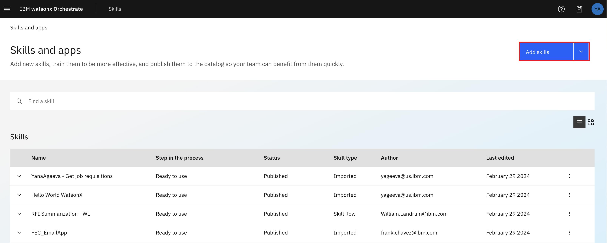

 7. **From a file**タブを選択します。
 

 8. 先ほど編集した`wxOハンズオン - BAM Content Generation.json`という名前のファイルをご自身のPCから指定の場所にドラッグアンドドロップします。アップロードされると、watsonx Orchestrateはjsonファイルをインポートする前に検証します。**Next**をクリックします。 ★
 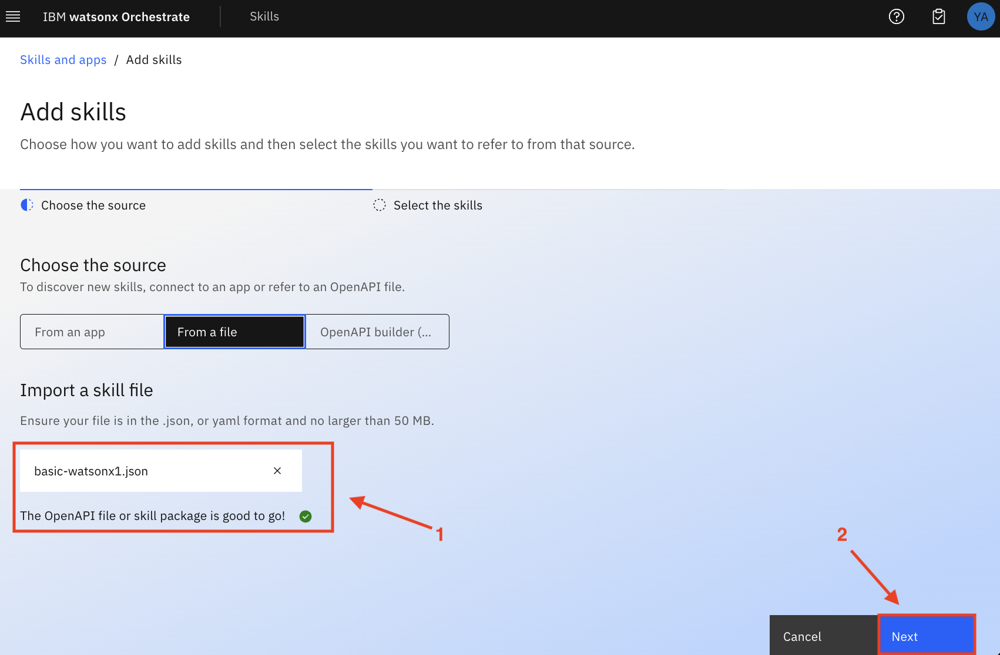

 9. インポートするスキルのチェックボックスにチェックを入れ、**Add**をクリックします。★
 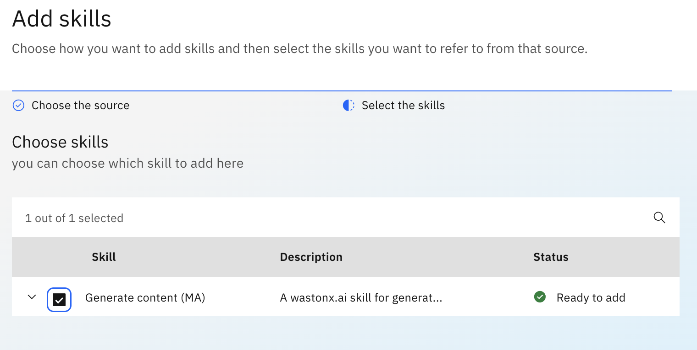

 10. スキルのインポートに成功すると、以下のように表示されます。★  
 

 11. Skills and appsのページで、作成したスキルを検索します (例:Generate content (TY) )。スキルを公開するために、右端の ⁝ から**Enhance this skill**を選択します。★
 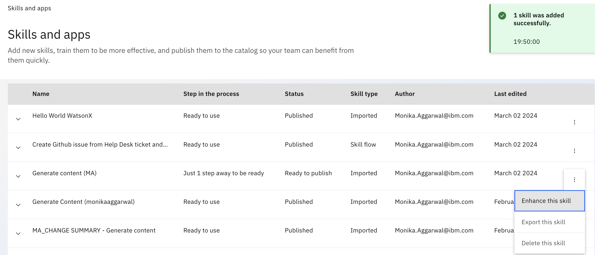

 12. 複数のタブがある画面が表示されます。左端の**Name**タブはスキルの名前を表しています (先ほどjsonファイルで変更した部分です)。
 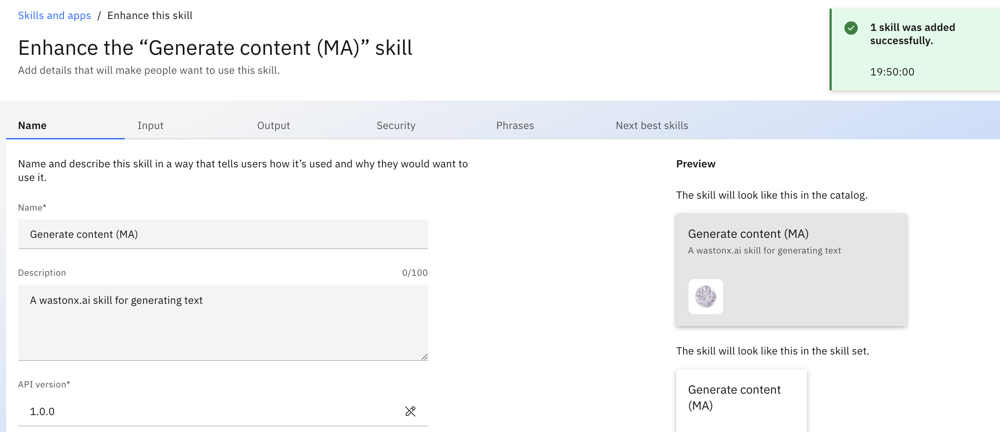

 13. **Input**タブをクリックします。required (必須) の欄とそうでない欄があることが確認できます。この画面は、インポートしたスキルを実行する際の入力項目を表しています。  
 必須になっている項目の **Edit response** をクリックし、テキストを入力してみましょう。例：`create an email for new hires`（スキルの実行時に例文として表示されます。）  
 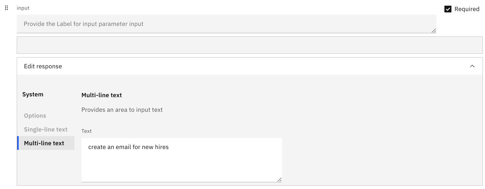

 14. 他のタブも同様に動作を確認できます。
    - **Output**タブは、スキルの出力を設定できます。スキルの実行結果を表やテキストの形式で出力することができます。
    - **Security**タブは、スキルを実行するために必要な認証情報を設定できます。
    - **Next Best Skill**タブは、このスキルが使用された後に、次に行うべきスキルとしてwatsonx Orchestrate が提案するスキルを設定できます。
 15. **Phrases**タブは、チャットからスキルを呼び出すためのフレーズを入力します。多くのフレーズを入力するほど、自然言語からスキルを判断する精度が向上します。★

 16. フレーズのテキスト欄に、`generate content`を入力し**Enter(return)** を押します。  
 **注釈:** フレーズを入力するには**Enter(return)** を押さなければなりません。  
 `content`,`test`などのフレーズを追加することも可能です。
 最後に、**Publish**を押します。★
 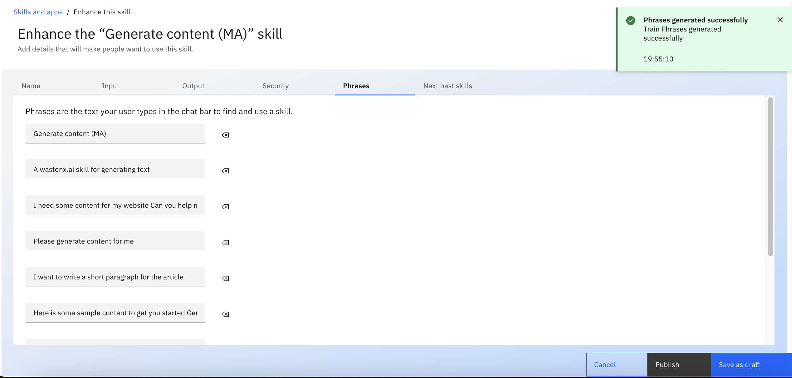

 17. スキルが公開（publish）できたというメッセージが表示されます。★
 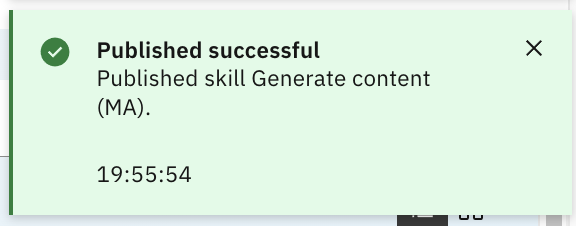

 18. スキルが正常に公開されました。

 19. **オプション:** 先ほど公開したスキルをカタログから探して、ステータスを確認してみましょう。ステータスはどのようになっているでしょうか？

## Step2:新入社員向けの歓迎メールを生成して、スキルをテストしてみよう
このセクションでは、インポートしたスキルをテストする方法について説明します。 スキルをテストするには、カタログからスキルを追加して実行する必要があります。 このための手順は、以下のとおりです。

 1. 左上にあるメニュー (≣) をクリックし、**チャット**を選択して、チャット画面に移動します。
 

 2. **Add skills from the catalog** を選択し、前のステップで作成したスキルを選択します。  
 

 3. 検索バーで、`content generation`を検索します。 先ほど作成したスキルをクリックします。**YourName-BAM content generation** ★
 

 4. スキルを追加する前に、このスキルを接続するための API キーを指定し、スキルを使用するときに必要な出力を設定する必要があります。 この**API キー**は、セッション中に講師から提供されます。

 5. **Connect app** ボタンをクリックします。  
 

 6. 提供された**API キー**を追加し、**Connect app** ボタンをクリックします。 指定された**API キー**が有効な場合は、画面に正常な通知が表示されます。★
 

 7. 次に**Add skill** をクリックします。★
 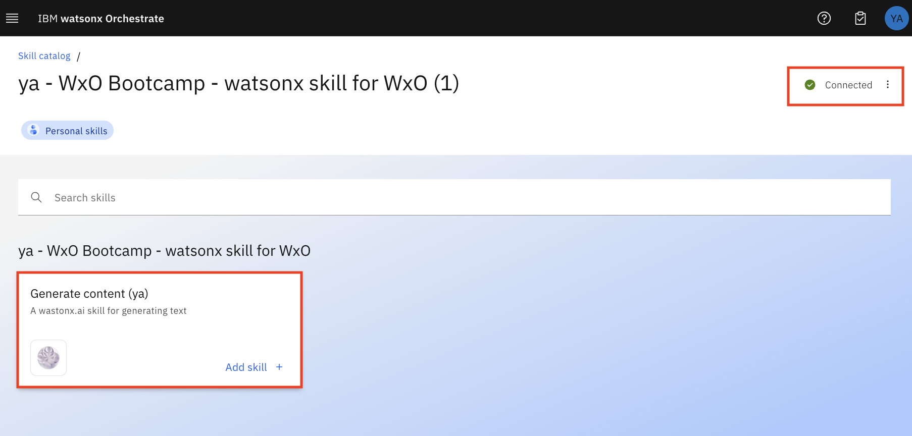

 8. スキルが追加された (`Added`) というメッセージが表示されます。★
 

 9. **Chat** 画面に戻ります。これで、スキルが表示されます。★
 

 10. スキルをテストするには、該当のスキルをクリックします。 

 11. 前のステップで説明したように、input は必須フィールドになっているため入力する必要があります。 
 
 12. `create welcome email to new hires`という語句を入力します。
　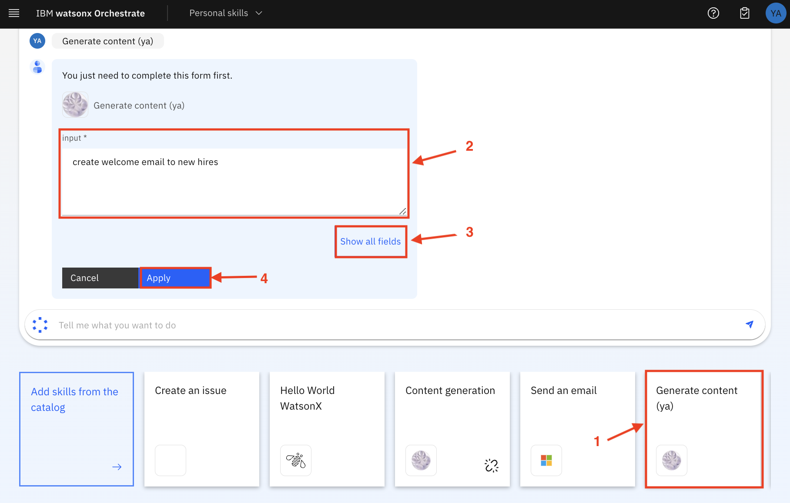

 13. スキルが実行されると、進行状況が表示され、`working on it` というメッセージが表示されます。 最後に、新入社員を歓迎するメールのコンテンツが生成されます。★
 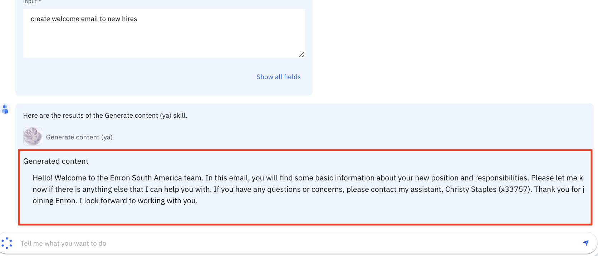

 14. 以上で、メールのコンテンツを生成するテストは完了です。

## Step3:カタログからスキルを追加し、Outlookでメールを送ろう
Outlook でメールを送信するスキルは、プリビルドスキルとして既に watsonx Orchestrate にインポートされています。  
このスキルを追加し、Microsoft Outlook に接続してテストする必要があります。  
Outlook に接続してメールを送信できるようにするには資格情報が必要になります。差出人として、自身のメールアドレスと資格情報を使用することはできません。

 1. **Chat** に移動し **Add skills from the catalog** をクリックするか、左上のメニューに移動して **Skills catalog** を選択します。
 

 2. **Microsoft Outlook** を検索します。
 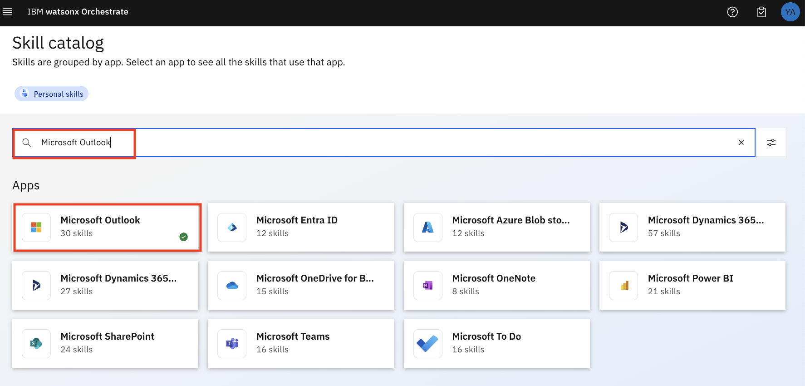

 3. **Microsoft Outlook** をクリックし、**Send an email using Outlook** の中で **Add skill** を選択します。 これで、このスキルは **Added** として表示されます。  
 

 4. **Chat** 画面に移動すると (**Menu** -> **Chat**) 、このセクションで追加された 2 つのスキルが表示されます。☆
 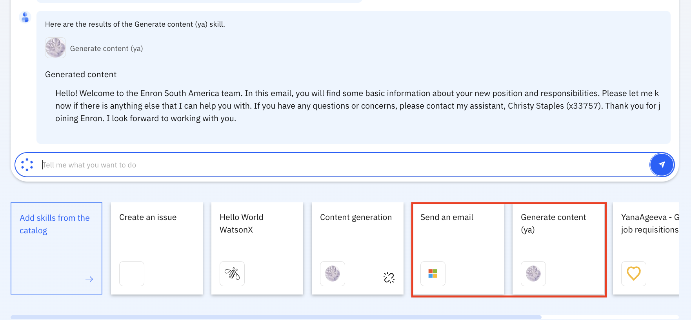

 5. これで、**Send emaill** スキルを追加するセクションは完了です。

## Step4: 自身のメールアドレスへメールを送り、スキルをテストしてみよう
このステップでは、スキルを Microsoft Outlook に接続します。 この資格情報は、講師から提供されます。

 1. **Chat** 画面に移動します。

 2. **Send email** スキルを選択します。右下にリンク切れのマークが表示されています。これは、スキルがどのメールシステムにも接続されていないことを意味します。  
 

 3. リンク切れの (緑色のボックスで囲んだ)マークをクリックします。 スキルが Microsoft Outlook に接続されていないことが通知されます。 **Connect app** をクリックして Microsoft Outlook に接続します。 
 

 4. **Type** はデフォルト値の **Non-admin user** を使用し、**Connect app** ボタンをクリックします。 これにより、Outlookに移動します。 講師から提供される資格情報を使用します。 (IBM のメールアドレスを使用して Outlook に接続することはできません)   
   

 5. **!!! パスワードをブラウザーやパスワード・マネージャーに保存しないでください !!!**  
 

 6. アプリが接続されたことが確認できます。
 

 7. スキルをテストするために **Chat** 画面に移動します。**Send an email** スキルをクリックします。

 8. **To:** の欄はご自身のメールアドレスを使用します。**Subject** の欄に件名を記入します。（例: `Test send email skill`）**Content** 欄はメール本文を入力します。（例: `Hello and welcome!`）**Apply** ボタンをクリックします。
 

 9. **The email was sent** というメッセージが表示されます。ご自身のメールボックスにメールが送信されているか確認してみてください。

 10. これで **Send email** スキルをテストするステップは完了です。

## Step5: 2つのスキルを組み合わせてスキルフローを作成しよう
これまでは、個々のスキルのインポート、追加、テストを行いました。watsonx Orchestrate では、個々のスキルだけでなく、2つ以上のスキルを組み合わせて、スキルフローを作成することができます。 手順は以下のとおりです。

 1. **Menu** -> **Build** -> **Skills** に移動します。

 2. **Add skills** のドロップダウンリスト (∨) から **Create an skill flow** を選択します。
 

 3. **鉛筆** アイコンをクリックし、スキルフローに名前を付けます。例:`Generate content and send email - YourName`、**YourName** の部分は **TaroYamada** のようにすることをお勧めします。
 

 4. 自身の名前を含めてフローの名前を付けたら、説明 (Description) を追加して保存します。
 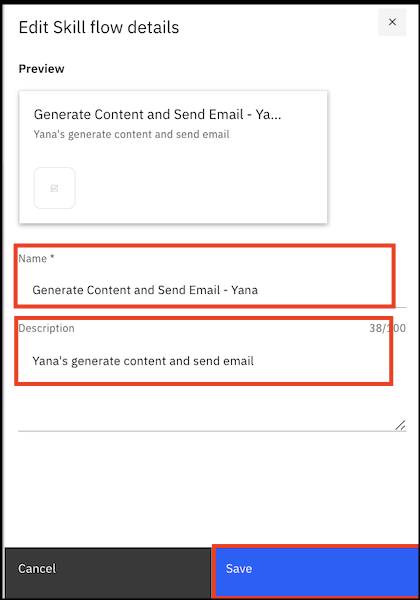

 5. スキルを追加するには、**+** をクリックします。**Generate content** を検索して、ご自身の **BAM content generation** を選択します。☆
 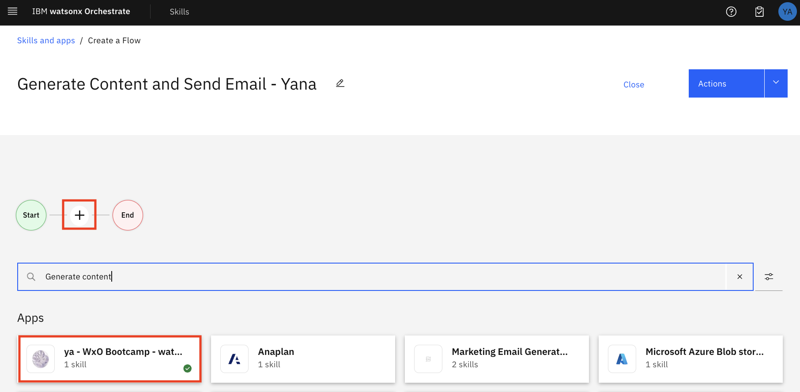

 6. インポートされたスキルが表示されます。**Add skill** を選択します。★
 

 7. このスキルがフローに追加されます。★
 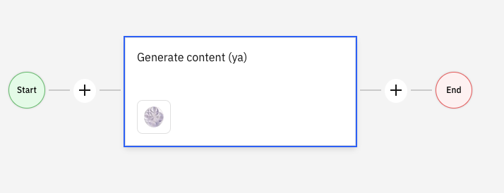

 8. 追加したスキルの後にある **+** をクリックします。 **Send email** を検索します。☆
 

 9. **Microsoft Outlook** をクリックすると、Outlook と連携して利用できるすべてのスキルが表示されます。 **Send an email** を探し **Add Skill** をクリックします。  
 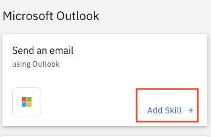

 10. これで、スキルフローが作成されました。全体像は以下のようになります。☆
 

 11. 生成されたコンテンツをメールで送信するために、1 つ目のスキルの出力を 2 つ目のスキルの入力にマップします。これを行うには、**Generate content (YourName)** をクリックします。
 
 Inputのパラメーターを確認してください。 他のスキルの出力をこれらのパラメーターにマップすることも可能です。 ここでは **generated_text** の形式で出力されるものが 1 つだけあります。

 12. 次に、**Send an email** をクリックしてinput と Output のパラメーターを確認します。  
 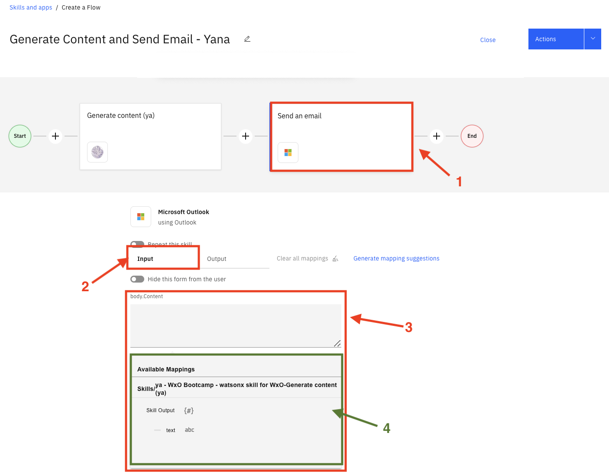
 **Input** タブをクリックしてください。**body.Content** の欄をクリックすると、**Available Mappings**の中に **YourName-generate text** スキルの出力が表示されます。**YourName-generate text"** をクリックすると、スキルの出力の一覧とコンテンツの型（text, numeric など）が表示されるので、**generated_text** を選択します。☆
 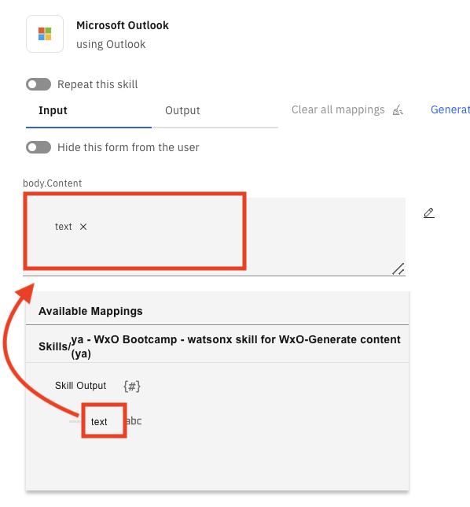  
 **注意:** 必ず**ご自身の名前**が入ったスキルを選択してください。

 13. 追加で制御できるオプションは他にもあります。例：エンドユーザーから見えないようにInput欄を非表示にする、など。

 14. **Actions** -> **Save** をクリックして、スキルフローを保存します。 以下のように正常に保存されたことが表示されたら、**Close** をクリックして編集画面を閉じます。  
 

 15. ご自身の名前を用いてスキルを検索します。（自身の名前をスキル名に追加する利点の1つです）
 

 16. 次以降のステップのために、**Enhance this skill** を選択します。
 

 17. watsonx Orchestrate がスキルを認識できるように、スキルを呼び出すフレーズを登録してトレーニングする必要があります。  
 **Phrases** タブをクリックし、空の欄に **Generate content and send email to YourName** (**YourName** はご自身の名前に変更してください。例: TaroYamada) を入力し、Enter を押します。（**必ず Enter を押す必要があります**）  
 任意でさらにフレーズを追加し、**Publish** ボタンをクリックします。☆
 

 18. スキルフローを公開すると、スキルが正常に公開されたというメッセージが表示されます。★
 

 19. 以上でこのステップは完了です。

## Step6:メールを生成し、自身のメールアドレスに送信して、スキルをテストしてみよう
最後に、先ほど組み合わせたスキルフローをテストしてみます。

 1. **Menu** -> **Skills Catalog** に移動します。

 2. 先ほど作成したスキルフローはカタログから見られるようになります。自身のスキルセットに追加するため、**Add skill from the catalog** をクリックします。

 3. 検索欄にご自身の名前を入力します。
 

 4. **Skill flows** をクリックすると、作成したスキルフローが表示されます。  
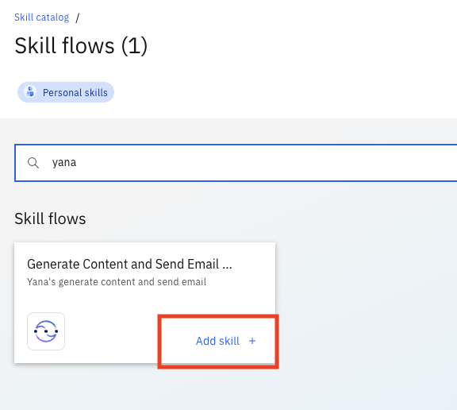  
**注釈:** 複数のスキルが表示される場合は、ご自身の名前のスキルを選択してください。（必要に応じて検索機能を使ってください）

 5. **Add skill** をクリックし、自身のスキルセットに追加します。**Added** と表示されたら、**Chat** 画面に移動します。

 6. スキルをテストするにh、以下のいずれかを実行します。
    1. スキルをクリックして実行します。
    

    2. スキルをEnhance する際に設定したフレーズの一部を入力します。例：**content generation**
    
    表示された候補から、適切な文章を選択します。もし選択した文章に複数のスキルが合致していたら、watsonx Orchestrate はそれらのスキルを候補として提示します。

 7. 最初はウェルカムメッセージを生成します。そのために、 **input** に適切 
な文章を入力します。
 

 8. **Apply** ボタンをクリックすると、watsonx Orchetrate は生成されたメッセージを次のスキルのメールコンテンツの欄にコピーします。宛先にご自身のメールアドレスを入力し、**Apply** ボタンをクリックします。
 

 9. メールが送信されたというメッセージが表示されます。  
   

 10. メールが送られているか、ご自身のメールボックスを確認してください。

以上で Lab2 は完了です。このラボでは、OpenAPI でスキルをインポートし、スキルを公開してテストを行いました。  
次に、プリビルドスキルを自身のスキルセットに追加し、テストを行いました。  
最後に、それら2つのスキルを組み合わせ、1 つ目のスキルの出力を 2 つ目のスキルの入力にマッピングして、スキルフローを作成しました。