# Lab4 Automation

このLabでは、特定の基準に依存したアクションを実行する方法について学びます。  
例えば、ローン申請者の収入やクレジット・スコアに応じてローンを承認したい場合にはルール・ベースでの意思決定を行うことが有用です。  
watsonx Orchestrateはルール・エンジン機能を提供するため、意思決定を実装してスキルとして呼び出すことによりこの判断を行うことが可能です。

## 前提条件
 1. watsonx Orchestrateの環境にアクセスできること。  
 [https://dl.watson-orchestrate.ibm.com/](https://dl.watson-orchestrate.ibm.com/) 　　 
 2. IBM-idを用いてログイン可能であること。
 3. Automationsを用いて自動化を作成する権限があること。(Builder権限)


## watsonx Orchestrateへのアクセス

 1. watsonx Orchestrateにログインします。
 2. IBM-idを入力して、**Continue** ボタンをクリックします。
 3. 複数テナントに所属する場合には、テナント選択画面が表示されるので、適切なテナント名を選択してください。  


## Automationの作成
このセクションでは、Automationを作成します。

1. Automationsをクリックします。もしくは、左上のメニューから**Automations**を選択してもOKです。  


5. 右上の**Create automation**をクリックします。


6. Automationの作成ダイアログが表示されるので、**あなたのイニシャル_Lending_Services**という名前を入力し、**Create**をクリックしてください。


7. 以下のようなダイアログが表示されます。意思決定、ワークフロー、生成AIに関する処理を実装することが可能です。今回は意思決定に関するスキルを実装するため、**Decision**をクリックします。    


8. 次にDecisionのモデルを選択します。3つのモデルを選択可能ですが、今回はDecision Modelを作成します。Decision ModelはDMN(Decision Model Notation)と呼ばれる標準の形式で意思決定をモデル化することが可能です。  
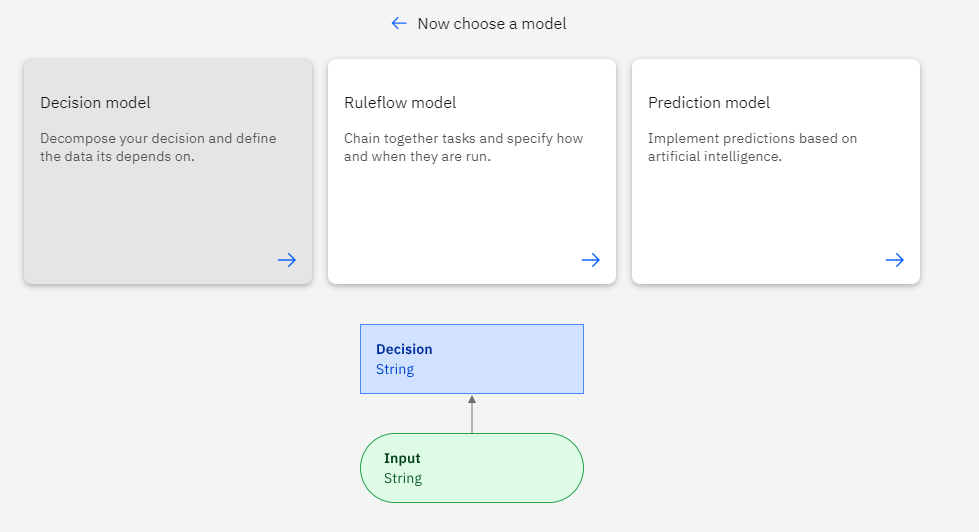

9. Decisionの名前を指定します。**あなたのイニシャル Personal Loan**という名前を指定して、**Create**ボタンをクリックしてください。  


10. 次のようなDMN形式のダイアグラムが表示されます。緑のノード(Inputノード)はルールによって使用されるデータを表現します。  青いノード(意思決定ノード)は意思決定のステップを表現します。意思決定ノードにはそのステップで実行されるルールが含まれます。それぞれの意思決定ノードは部分的な意思決定の結果を出力します。複雑な意思決定には多くの意思決定ノードが含まれ、一つの意思決定ノードの出力が他の意思決定ノードの入力フローとして動作します。  
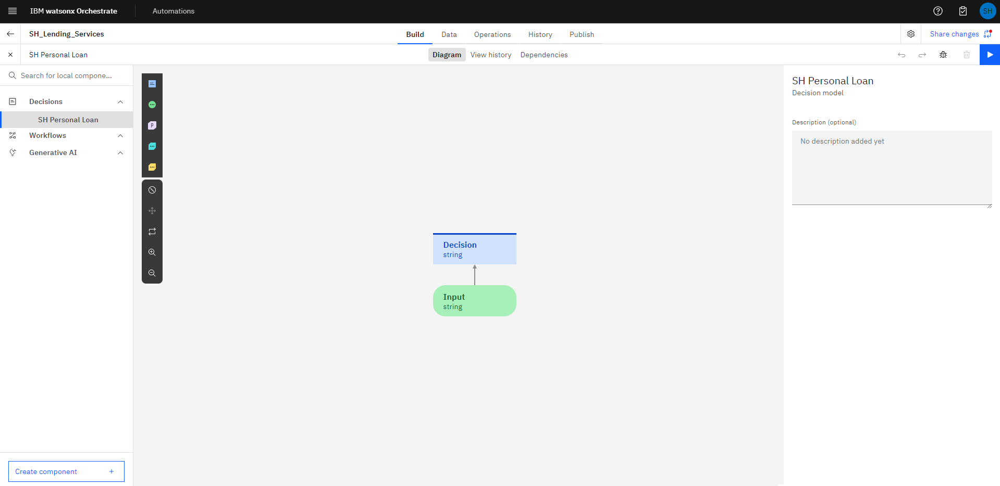

## Input ノードの実装
このセクションでは、Inputノードの定義をしていきます。

1. Inputノードをクリックし、右側に表示される編集欄から、Node nameを**applicant name**に変更してください。  
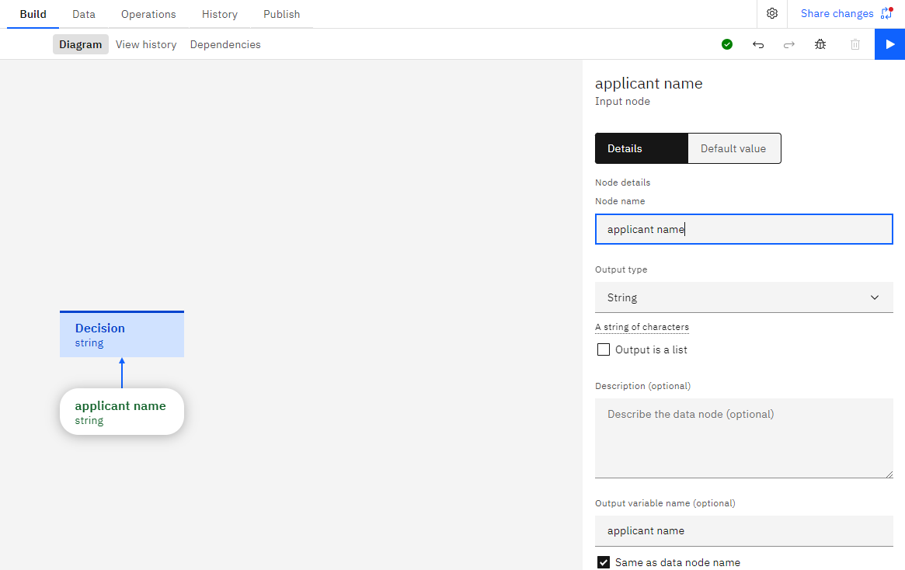

2. パレットからAdd Input Nodeをクリックし、新規にInputノードを追加します。  
  

3. 追加されたノードをクリックし、右側の編集欄から、Node nameを**income**に、Output typeを**Integer**にしてください。


4. incomeノード上にマウス・カーソルを動かすと、アイコンが表示されるので、**Connect to another node**をクリックし、decision nodeに接続してください。(もしくは、DecisionノードのメニューからAdd Inputを選択した場合には自動的に接続されます)  
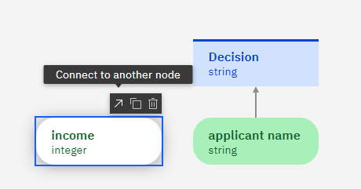  

5. 1-4の手順を繰り返し、以下の表に従って新規ノードを追加してください。  

|Node name|Node type|
|---------|---------|
|employed|boolean|
|SSN|string|
|loan purpose|string|
|credit score|integer|

6. 意思決定ダイアグラムは以下の様になるはずです。  
  


## ルールの作成
次に、意思決定ノードの中で実行されるルールをいくつか作成します。ルールは構文形式と意思決定表の形式で記述することが可能です。(日本語を用いることも可能ですが、現在のバージョンではサポートされていないため英語での記述になります。)

1. 初めに作成するのは、デフォルト・ルールです。デフォルト・ルールは、承認の意思決定の結果を初期化するために用います。その他のルールにはローンを却下する場合の条件を指定します。デフォルトのルールを作成するには、意思決定ノードを選択し、Logicタブをクリックしてから+ボタンをクリックし、Default ruleを選択します。  


2. 次のような意思決定エディタが表示されるので、string placeholder(<a string\>と表示されている場所)をクリックしてドロップダウンからstringを選択し、**approved**と入力してください。


3. ルールは以下の様になっているはずです。    


4. 次に、クレジット・スコアが600以下の申請者の申請はすべて却下するルールを追加します。+ をクリックして、Business Ruleを選択します。ルールの名前を**decline low credit score**として、Select the criteria for your ruleでcredit scoreを選択してから**create**をクリックしてください。   
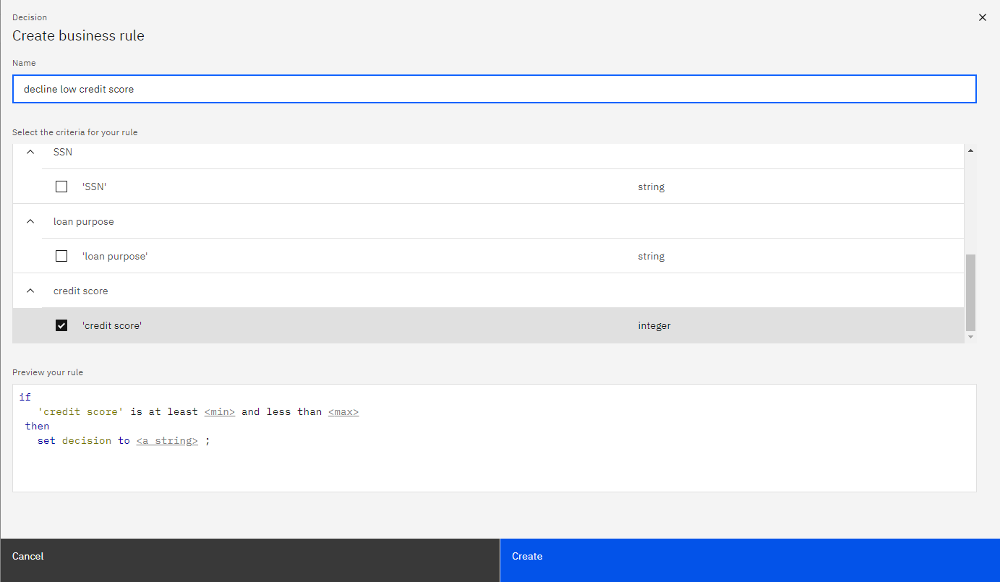

5. ルールのテンプレートを以下の様に修正します。なお、Ctrl+Space(Macの場合はControl+Space)でコード補完が可能です。  


6. (オプション)例えば、無職の場合(employed is false)にローンを却下するなど、入力された値によってローンが却下されるようないくつかのルールを追加してみてください。(デフォルトで、ローンの申請は承認され、ルールは却下する理由を判定することに注意してください。)   


## 意思決定のテスト
作成した意思決定はテスト・データを指定してテストすることができます。

 1. 右上の**Preview**アイコンをクリックしてください。  
 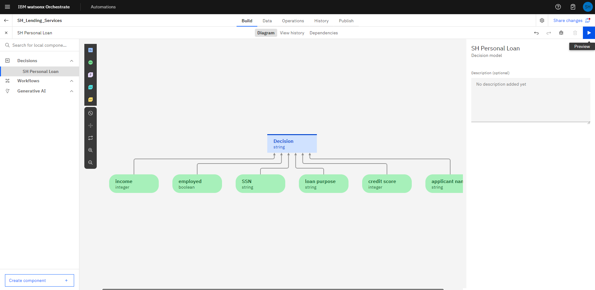

 2. **Add test data set**をクリックしてテスト・データを追加します。  
 

 3. 左側に各項目の入力画面が表示されるので、＋をクリックして入力してから**pewview**ボタンをクリックして意思決定の出力を確認してください。例えば、creditScoreに500を入力して実行した場合、却下されるはずです。  


## 意思決定サービスのデプロイ
正しく動作することが確認できたら、スキルとして呼び出せるようにサービスをデプロイします。  

1. Back to "XX Personal Loan"をクリックしてください。  


2. **Operations**タブをクリックしてください。スキルとして呼び出されるオペレーションを定義します。  


3. **Create operation**ボタンをクリックしてください。  


4. オペレーションの設定画面が表示されるので、Operation nameを**XXPersonalLoan**、Componentとして XX Personal Loanを選択してから**save**をクリックしてください。この操作によってスキルとして呼び出されるオペレーションが作成されます。  


5. 次にページ右上にある**Share changes**タブをクリックします。  


6. **Share**ボタンをクリックしてください。ダイアログが表示されるので**Share**をクリックします。この操作により、リポジトリに変更が反映されます。  


7. 左上の←をクリックしてLending Serviceのレベルに戻り、**History**タブをクリックしてください。  


8. 右側の+アイコンをクリックし、バージョンを作成します。  
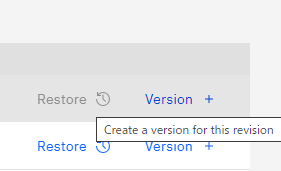

9. バージョンの名前としてnameの欄に**1.0.0**と入力し、**Create**をクリックしてください。   　　
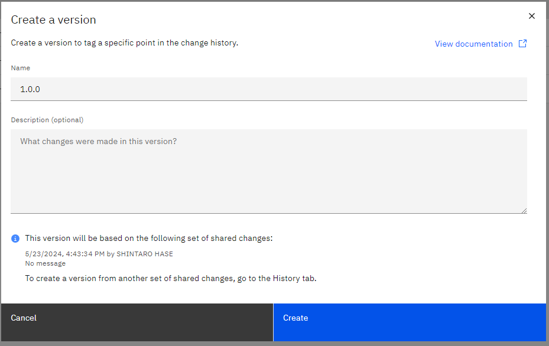

10. バージョンが作成されたら、**Publish**タブをクリックし、作成されたバージョンを展開し、**Publish**をクリックしてください。ダイアログが表示されるので**Publish**をクリックします。  


11. 意思決定サービスがパブリッシュされ、実行可能になりました。このサービスに紐づいたスキルがOrchestrate上に作成されます。左上のメニューから**Skills and apps**を選択してから、**Skills**タブをクリックし、スキルの一覧を表示させます。  
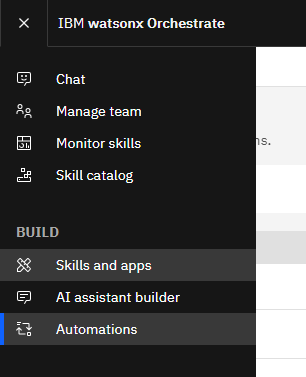

12. 作成した意思決定のスキルがReady to Publishの状態で表示されているはずです。
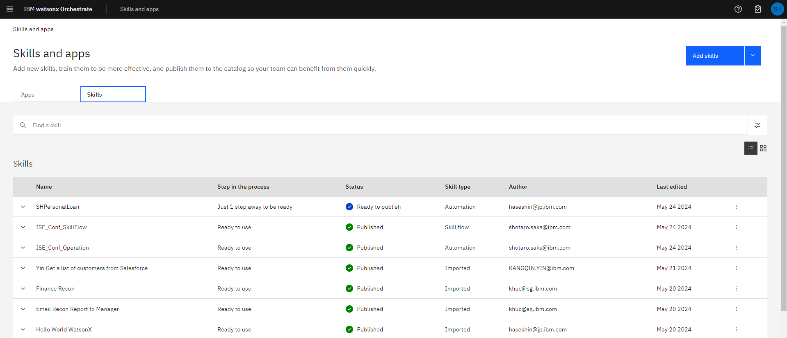

## スキルのエンハンス
スキルのエンハンスを行い、各入力パラメータの表示形式や振る舞いを変更してみます。以下の様に変更します。変更はスキルのエンハンス画面から実施することが可能です、また、スキルが定義されているOpenAPI定義を直接変更することでより細かい変更が可能です。 

|入力パラメータ|振る舞い|
|-----|---|
|income|必須|
|loan purpose|選択肢|
|credit score|説明を追加|
|SSN|非表示|
|employed|default value:true|


1. スキルの右側のメニューを展開し、**Enhance this skill**を選択します。  
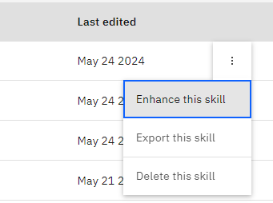

2. **Input**タブをクリックし、incomeの**Required**にチェックを入れてください。  
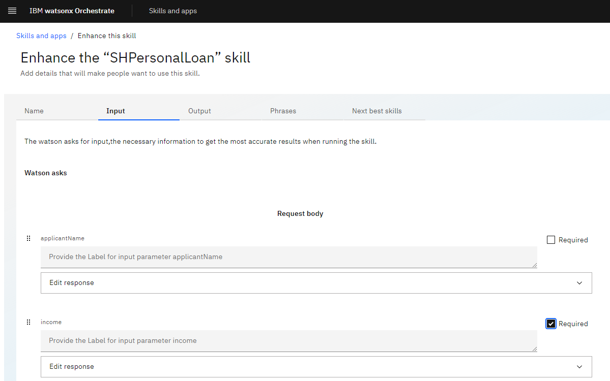

3. loanPurposeの**Options**を選択し、**medical emergency**,**consolidate debt**,**home improvement**の3つのOptionを設定してください。  
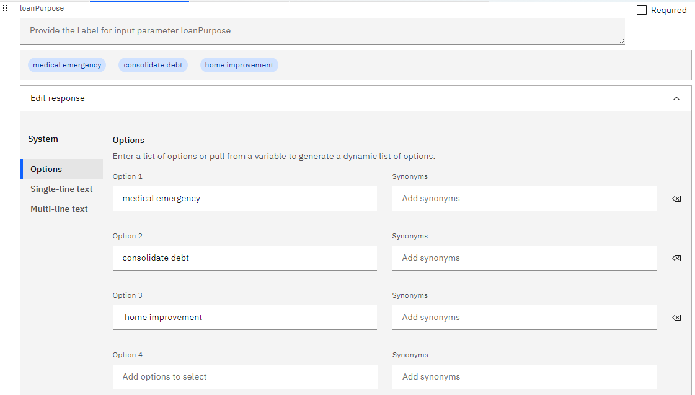

4. creditScoreを選択し説明に**Provide the Experian credit score**を入力してください。  


5. **Save as draft**をクリックして変更を保存します。  


6. スキル一覧画面に戻り、**Export this skill**を選択し、スキルをエクスポートし、ローカルにjsonファイルを保存します。  


7. メモ帳やエディタなどで保存したファイルを開きます。(実際のファイルは改行が含まれません、必要に応じてお使いのエディタでフォーマットしてください。)  各項目はx-ibmプロパティによって設定されます。x-ibmプロパティの詳細については[Understanding x-properties](https://www.ibm.com/docs/en/watson-orchestrate?topic=skills-understanding-x-properties)を参照してください。

8. **employed**は以下の様に設定されています。**,"default": "true"**となるようにファイルを編集してください。（カンマを含めることを忘れないでください） 
```
    "employed": {
                "type": "boolean",
                "x-ibm-order": 3,
                "x-ibm-multiline": "false",
                "default": "true"
                },
```
9. 同様にSSNの部分を修正し、以下の様に **,"x-ibm-show": "false"**を追加してください。
```
    "SSN": {
            "type": "string",
            "x-ibm-order": 4,
            "x-ibm-multiline": "false",
            "x-ibm-show": "false"
            },
```

10. ファイルを保存します。

11. Skills and appsの画面で**Add skills**をクリックします。  


12. **From a file**をクリックし、先ほど保存したファイルをドラッグ＆ドロップするか、クリックして選択してください。  
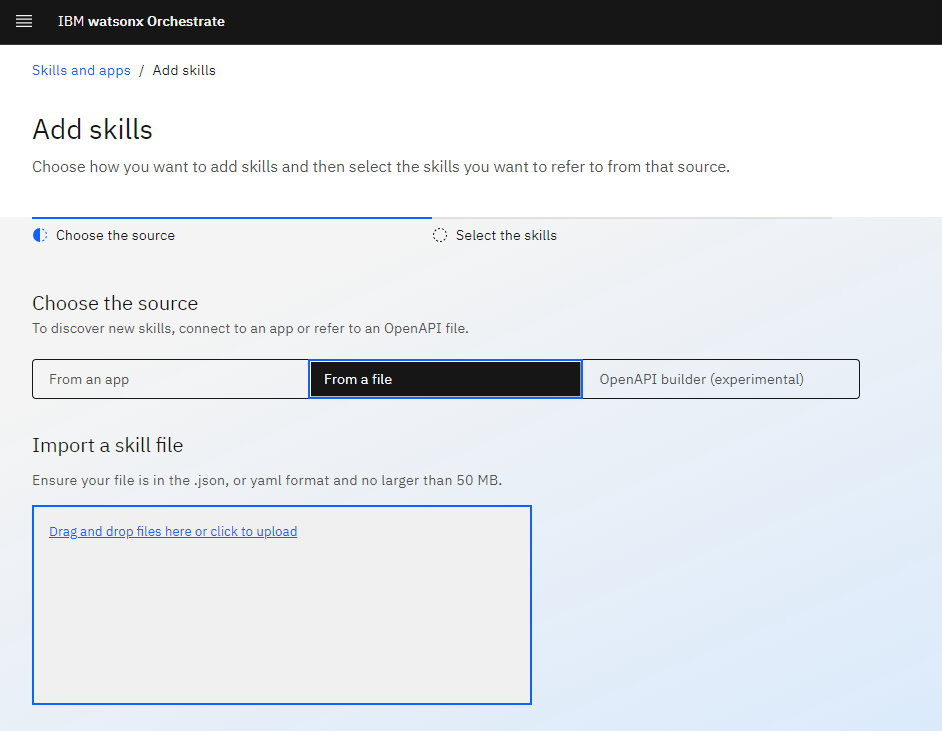

13. ファイルの検証が正しく行われたことを確認し**Next**をクリックします。エラーが表示された場合には、正しく編集されていることを確認してください。  


14. 既に存在するスキルをインポートするため、警告が表示されますが、スキルのチェックボックスにチェックをいれ、**Add**をクリックしてスキルを上書きします。  
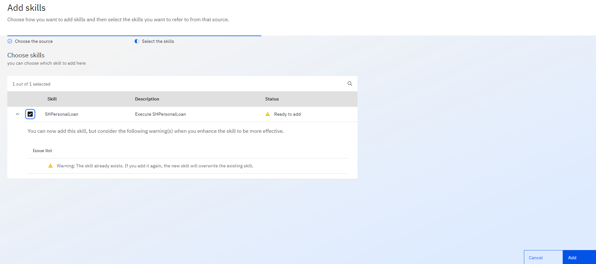

15. スキルの右側のメニューから**Enhance this skill**をクリックしてからスキルを**Publish**してください。  


16. 左側のメニューから**Skill catalog**を選択します。  


17. **あなたのイニシャル_Lending_Service**検索欄に記入して検索し選択し、**Add**をクリックしてスキルを追加します。
  
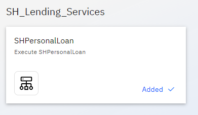

18. 左側のメニューからChatを表示し、チャットの入力欄に、**あなたのイニシャルPersonalLoan**と入力してみてください。 スキルのフォームが表示され、先ほど行ったカスタマイズが正しく行われていることを確認します。 


19. 値を入力し、正しい結果が返ってくることを確認してください。

## お疲れさまでした！
このハンズオンでは、Automation Builderを用いて意思決定サービスを実装し、スキルの入力フォームをカスタマイズしてから、チャット画面から呼び出しました。意思決定サービスを用いることで、AIが苦手な根拠のある正確な判断を実行することができます。　

## Option　意思決定表の実装
ルールを記述する際には今回のハンズオンで実施したような構文形式のルールの他に、意思決定表による実装も可能です。意思決定表はIf-Thenの組み合わせを表形式で表現するため、多数の条件を表形式で管理したい場合などに有効です。また、エクセルの表などをコピー＆ペーストすることも可能なため、より業務ユーザーが管理しやすいというメリットもあります。このオプションでは、先ほど実装した意思決定に、意思決定表形式の新たなルールを追加します。

1. Automation Builderで編集するDecisionのDiagramを開きます。

2. Diagram上で**Decision**をクリックし、右側のプロパティ画面より、Logicタブをクリックし、**+**アイコンをクリックしてください。  


3. 意思決定表を作成するため、**Decision table**を選択してください。  
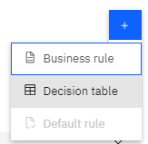

4. 今回は、収入(income)に応じた条件をテーブルとして定義してみましょう。そこで、Nameとして"Income table"という名前を入力し、使用する条件として**income**を選択し、Createをクリックしてください。  
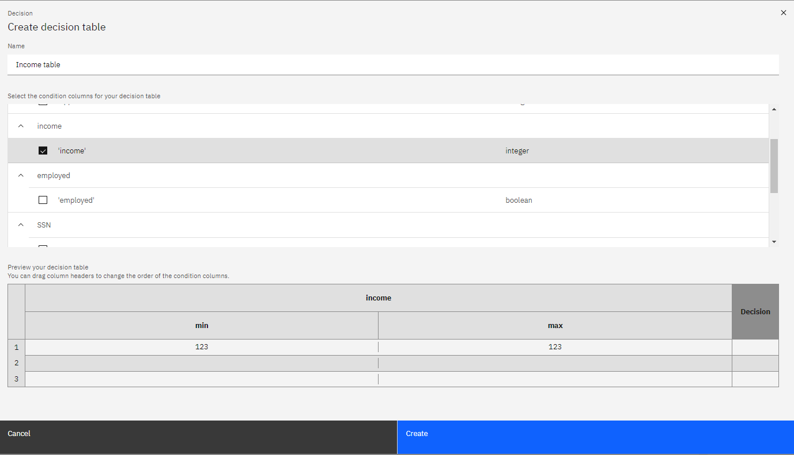

5. 次のようなテーブルが表示されます。incomeのminとmaxがカラムとして入力可能になっており、それらの条件を満たす場合のDecisionの値をDecision列に記入することが可能です。  
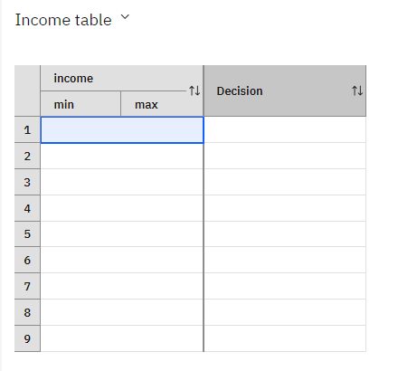

6. income列にカーソルを合わせると、次の様に、このカラムで定義されている条件文を確認することが可能です。  


7. 条件列のルールは、変更することも可能です。income列のヘッダーを右クリックし、**Define column**を選択してください。以下のようなダイアログが表示されます。ここで、条件をルール・言語を用いて記述することが可能ですが、今回は修正を行わないため、**Cancel**をクリックして閉じてください。   
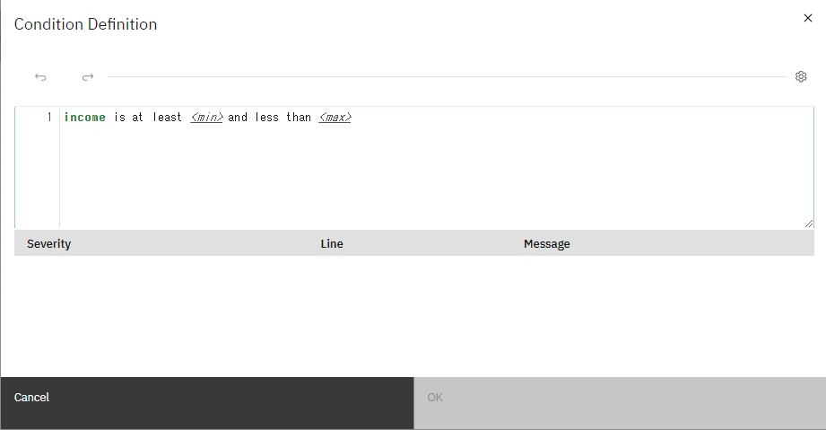

8. アクション列のルールも確認してみましょう。アクション列のヘッダーにカーソルを合わせると、カラムに入力した値がdecisionにセットされるという事が分かります。アクション・ルールも先ほどと同様に右クリックして編集することも可能です。意思決定表は条件列がAND条件で評価され、trueの場合にアクション列に定義されたアクションが実行されます。各条件行は個別に評価されます。   


9. 次に、incomeが0から10000の場合はdeclinedとなるルールを追加してみましょう。1行目のminに**0**,maxに**10000**,Decisionに"declined"を入力してください。  


9. 次にincomeが10000以上の場合にはapproveとなるルールを追加してみましょう。maxに大きな値を入れることも可能ですが、表の記入形式を変更することも可能です。2行目を右クリックして、**change operator** > **≧**を選択してください。  


10. 条件列に**10000**を、アクション列に**approved**を入力してください。  
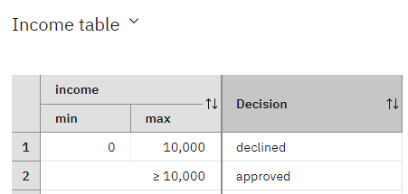

11. 作成したルールのテストをしてみましょう。画面右のプレビューアイコンをクリックしてテスト画面を開き、creditScoreが高く、employedがtrueであっても、incomeが10000以下の場合にローンが却下されることを確認してください。
