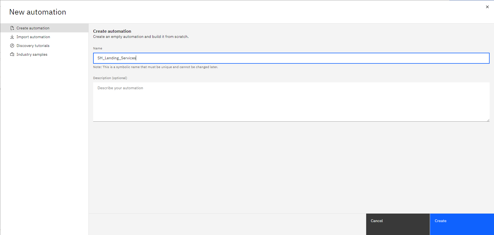
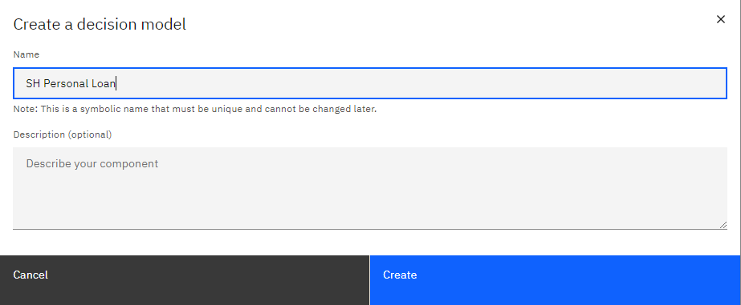
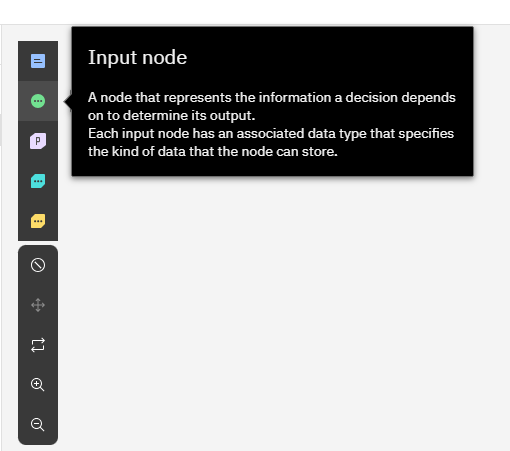
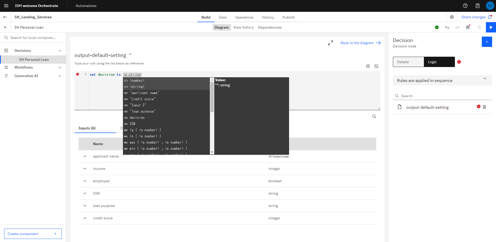
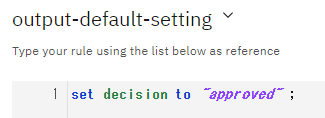
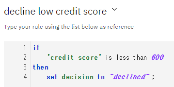
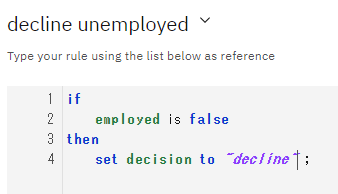
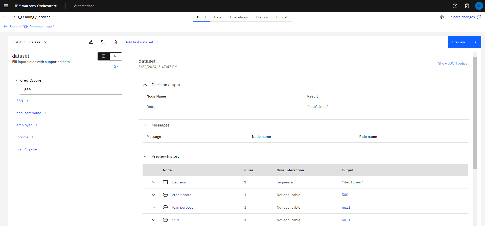
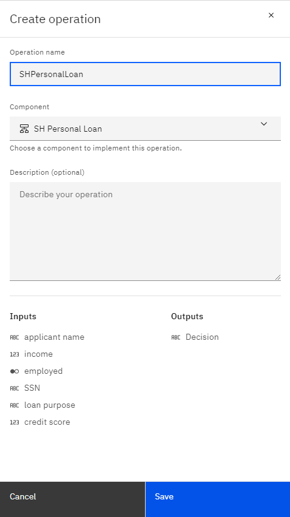

# Technical Lab3

このLabでは、特定の基準に依存したアクションを実行する方法について学びます。  
例えば、ローン申請者の収入やクレジット・スコアに応じてローンを承認したい場合にはルール・ベースでの意思決定を行うことが有用です。  
watsonx Orchestrateはルール・エンジン機能を提供するため、意思決定を実装してスキルとして呼び出すことによりこの判断を行うことが可能です。

## 前提条件
 1. watsonx Orchestrateの環境にアクセスできること。  
 [https://dl.watson-orchestrate.ibm.com/](https://dl.watson-orchestrate.ibm.com/) 　　 
 2. IBM-idを用いてログイン可能であること。
 3. Automationsを用いて自動化を作成する権限があること。(Builder権限)

## watsonx Orchestrateへのアクセス
このセクションでは、watsonx Orchestrateの主な画面構成について学びます。

 1. watsonx Orchestrateにログインします。
 2. IBM-idを入力して、**Continue** ボタンをクリックします。
 3. 複数テナントに所属する場合には、テナント選択画面が表示されるので、適切なテナント名を選択してください。  

## Automationの作成

1. Automationsをクリックします。もしくは、左上のメニューから**Automations**を選択してもOKです。  

5. 右上の**Create automations**をクリックします。

6. Automationの作成ダイアログが表示されるので、**あなたのイニシャル_Lending_Services**という名前を入力し、**Create**をクリックしてください。

7. 以下のようなダイアログが表示されます。意思決定、ワークフロー、生成AIに関する処理を実装することが可能です。今回は意思決定に関するスキルを実装するため、**Decision**をクリックします。    

8. 次にDecisionのモデルを選択します。3つのモデルを選択可能ですが、今回はDecision Modelを作成します。Decision ModelはDMN(Decision Model Notation)と呼ばれる標準の形式で意思決定をモデル化することが可能です。  

9. Decisionの名前を指定します。**あなたのイニシャル Personal Loan**という名前を指定して、**Create**ボタンをクリックしてください。  

10. 次のようなDMN形式のダイアグラムが表示されます。緑のノード(Inputノード)はルールによって使用されるデータを表現します。  青いノード(意思決定ノード)は意思決定のステップを表現します。意思決定ノードにはそのステップで実行されるルールが含まれます。それぞれの意思決定ノードは部分的な意思決定の結果を出力します。複雑な意思決定には多くの意思決定ノードが含まれ、一つの意思決定ノードの出力が他の意思決定ノードの入力フローとして動作します。  

## Input ノードの実装
Inputノードの定義をしていきます。

1. Inputノードをクリックし、左側に表示される編集欄から、Node nameを**applicant name**に変更してください。  

2. パレットからAdd Input Nodeをクリックし、新規にInputノードを追加します。  
  

3. 追加されたノードをクリックし、右側の編集欄から、Node nameを**income**に、Output typeを**Integer**にしてください。

4. incomeノード上にマウス・カーソルを動かすと、アイコンが表示されるので、**Connect to another node**をクリックし、decision nodeに接続してください。(もしくは、DecisionノードのメニューからAdd Inputを選択した場合には自動的に接続されます)  
  

5. 1-4の手順を繰り返し、以下の表に従って新規ノードを追加してください。  

|Node name|Node type|
|---------|---------|
|employed|boolean|
|SSN|string|
|loan purpose|string|
|credit score|integer|

6. 意思決定ダイアグラムは以下の様になるはずです。  
  

## ルールの作成
次に、意思決定ノードの中で実行されるルールをいくつか作成します。ルールは構文形式と意思決定表の形式で記述することが可能です。(日本語を用いることも可能ですが、現在のバージョンではサポートされていないため英語での記述になります。)

1. 初めに作成するのは、デフォルト・ルールです。デフォルト・ルールは、承認の意思決定の結果を初期化するために用います。その他のルールにはローンを却下する場合の条件を指定します。デフォルトのルールを作成するには、意思決定ノードを選択し、Loanタブをクリックしてから+ボタンをクリックし、Default ruleを選択します。  

2. 次のような意思決定エディタが表示されるので、string placeholder(\<a string\>と表示されている場所)をクリックしてドロップダウンからstringを選択し、**approved**と入力してください。

3. ルールは以下の様になっているはずです。    

4. 次に、クレジット・スコアが600以下の申請者の申請はすべて却下するルールを追加します。+ をクリックして、Business Ruleを選択します。ルールの名前を**decline low credit score**として、criteria chocesでcredit scoreを選択してから**create**をクリックしてください。   

5. ルールのテンプレートを以下の様に修正します。  

6. (オプション)例えば、無職の場合(employed is false)にローンを却下するなど、入力された値によってローンが却下されるようないくつかのルールを追加してみてください。（デフォルトで、ローンの申請は承認され、ルールは却下する理由を判定することに注意してください。)   

## 意思決定のテスト
作成した意思決定はテスト・データを指定してテストすることができます。

 1. 右上の**Preview**アイコンをクリックしてください。  
 

 2. **Add test data set**をクリックしてテスト・データを追加します。  
 

 3. 左側に各項目の入力画面が表示されるので、＋をクリックして入力してから**pewview**ボタンをクリックして意思決定の出力を確認してください。例えば、creditScoreに500を入力して実行した場合、却下されるはずです。  

## 意思決定サービスのデプロイ
正しく動作することが確認できたら、スキルとして呼び出せるようにサービスをデプロイします。  

1. Back to "XX Personal Loan"をクリックしてください。  

2. **Operations**タブをクリックしてください。スキルとして呼び出されるオペレーションを定義します。  

3. **Create operation**ボタンをクリックしてください。  

4. オペレーションの設定画面が表示されるので、Operation nameを**XX Personal Loan**、source modelとして XX Personal Loanを選択してから**save**をクリックしてください。この操作によってスキルとして呼び出されるオペレーションが作成されます。  

5. 次にページ右上にある**Share changes**タブをクリックします。  

6. **Share**ボタンをクリックしてください。ダイアログが表示されるので**Share**をクリックします。この操作により、リポジトリに変更が反映されます。  

7. 

Next, click on the Share changes tab at the top of the page, and click the Share button in the dialog.

1. メニューからチャット画面に戻ります。スキルが追加されていることが分かります。  

## スキルの動作確認
カタログから追加したスキルは以下の2つの方法で実行可能です:
- チャット画面下部に表示されているスキルをクリックする
- スキルをEnhanceした際に指定したフレーズ(watsonx Orchestrateがしたいされたフレーズを元に学習するため、完全一致する必要はありません)を入力する

1. チャットの入力欄に、**Hello World WatsonX**と入力してみてください。  

2. 先ほど追加したスキルが呼び出され、入力フォームが表示されます。  

3. 自分の名前を入力し、**Apply**ボタンをクリックしてください。結果が表示されるはずです。  

4. チャットの内容は右上のホウキアイコンをクリックすることで削除することが可能です。  
  

## Option　意思決定表の作成

## お疲れさまでした！
このハンズオンでは、watsonx Orchestrateにログインし、カスタムスキルを追加、EnhanceしてからPublishし、カタログに追加しました。そしてカタログからスキルを追加し、チャット画面から呼び出しました。　

